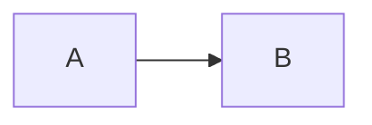

# Confluence Mermaid 동작 방식 분석

- 분석 대상: <https://pms-innogrid.atlassian.net/wiki/spaces/PAAS/pages/2177630217/DevOpsit+CCP>
- 분석 일자: 2026-08-11, 실패 재검증 2026-08-12 (Asia/Seoul)
- 분석 범위: 대상 페이지의 Mermaid 매크로 저장 구조, 편집 UX, 조회 화면 렌더링 방식, 오류 처리
- 분석 방법: 로그인된 Chrome에서 조회·편집 화면과 Forge iframe을 관찰하고, 동일 페이지의 ADF를 교차 확인했다.

## 1. 결론

대상 Confluence 환경의 Mermaid는 Confluence 기본 코드 블록이 직접 다이어그램을 그리는 방식이 아니다. `Mermaid diagram`이라는 별도 Forge 매크로가 같은 페이지에 있는 코드 블록 하나를 선택하고, 선택한 코드 블록의 텍스트를 Mermaid 라이브러리로 변환해 SVG로 표시한다.

핵심 구조는 다음과 같다.

```text
ADF codeBlock 목록
  └─ codeBlock[n]의 일반 텍스트
       ↓ guestParams.index = n
ADF extension 노드: Mermaid diagram
       ↓ Confluence Forge 런타임
Atlassian CDN의 Custom UI iframe
       ↓ Mermaid 11.15.0
인라인 SVG 또는 문법 오류 화면
```

따라서 Markdown의 `mermaid` fence를 ADF `codeBlock` 하나로 변환하는 것만으로는 이 페이지에서 본 것과 같은 다이어그램이 되지 않는다. 코드 블록과 별도로 Forge 매크로 `extension` 노드가 필요하다.

## 2. 구성 요소

### 2.1 원본: 일반 ADF 코드 블록

Mermaid 매크로가 렌더링할 원문은 별도의 ADF `codeBlock`에 있다. 대상 페이지에는 총 11개의 코드 블록이 있고 언어는 대부분 `plaintext`, 하나는 `shell`로 저장되어 있었다.

중요한 점은 Mermaid 소스가 매크로의 ADF 노드 안에 중복 저장되지 않는다는 것이다. 매크로는 코드 블록의 텍스트를 직접 가지지 않고 코드 블록 목록의 순번만 가진다.

### 2.2 렌더러: Forge extension 노드

대상 페이지에는 아래 식별자를 사용하는 `extension` 노드가 두 개 있다.

| 항목 | 확인값 |
| --- | --- |
| ADF node type | `extension` |
| extension type | `com.atlassian.ecosystem` |
| extension title | `Mermaid diagram` |
| Forge 환경 | `PRODUCTION` |
| Forge app ID | `23392b90-4271-4239-98ca-a3e96c663cbb` |
| module ID | `63d4d207-ac2f-4273-865c-0240d37f044a` |
| extension module | `static/mermaid-diagram` |

저장 형태를 필요한 필드만 남겨 단순화하면 다음과 같다.

```json
{
  "type": "extension",
  "attrs": {
    "layout": "default",
    "extensionType": "com.atlassian.ecosystem",
    "extensionKey": "23392b90-4271-4239-98ca-a3e96c663cbb/63d4d207-ac2f-4273-865c-0240d37f044a/static/mermaid-diagram",
    "text": "Mermaid diagram",
    "parameters": {
      "guestParams": {
        "index": 8
      },
      "forgeEnvironment": "PRODUCTION",
      "extensionTitle": "Mermaid diagram"
    },
    "localId": "63f13912-e5c4-47ce-9c47-bb485fab29c1"
  }
}
```

실제 ADF에는 Confluence 페이지·스페이스·Forge 실행 문맥도 포함되지만 위 구조가 Mermaid 선택과 렌더링을 설명하는 핵심이다.

### 2.3 코드 블록 연결 방식

`parameters.guestParams.index`는 페이지 안 코드 블록 목록의 0부터 시작하는 순번이다.

| Mermaid 매크로 | `guestParams.index` | 편집 화면 표시 | 실제 참조 대상 |
| --- | ---: | --- | --- |
| 첫 번째 | `8` | `9. git init ...` | 아홉 번째 `shell` 코드 블록 |
| 두 번째 | `9` | `10. SVC ...` | 열 번째 `plaintext` 코드 블록 |

ADF의 index와 편집 화면의 번호·원문이 정확히 일치하므로 0-based index임을 확인할 수 있다. 코드 블록 `localId`를 참조하는 방식은 아니다.

이 방식은 코드 블록을 매크로보다 앞쪽에 추가하거나 순서를 변경했을 때 기존 index가 다른 블록을 가리킬 가능성이 있다. 실제 재정렬 후 보정 여부는 이번 조사에서 변경 테스트를 하지 않았으므로 별도 검증이 필요하다.

## 3. 편집 화면 동작

Confluence 편집기에서는 매크로가 `Mermaid diagram`이라는 extension 노드로 표시된다. 매크로를 선택하면 다음 플로팅 도구가 나타난다.

- 편집
- 정렬
- 복사
- 제거

`편집`을 누르면 같은 Forge 앱의 Custom UI iframe이 열리고 다음 설정을 제공한다.

- `Select codeblock with mermaid diagram to render` 선택 상자
- `Auto detect`
- 현재 페이지의 모든 코드 블록 목록
- `Submit`
- `Cancel`

설정 화면에는 다음 안내가 표시된다.

- Auto detect는 가장 가까운 다이어그램을 기본 선택한다.
- Mermaid 다이어그램으로 인식되지 않는 항목은 흐리게 표시한다.

대상 페이지에서는 첫 번째 매크로가 아홉 번째 코드 블록을 명시적으로 선택하고 있었다. 즉, 매크로 편집기는 페이지의 코드 블록을 수집하고 사용자가 고른 순번을 `guestParams.index`로 저장한다.

## 4. 조회 화면 렌더링

조회 화면에서 Confluence ADF renderer는 `extension` 노드를 일반 본문 HTML로 직접 그리지 않는다. 다음 구조로 Forge 앱을 호스팅한다.

```text
.ak-renderer-extension
  └─ [data-testid="ForgeExtensionContainer"]
       └─ [data-testid="hosted-resources-iframe"]
            └─ Mermaid Custom UI
```

확인된 iframe 특성은 다음과 같다.

- `data-forge-iframe="true"`
- Atlassian 개발 CDN의 `custom-ui` 리소스를 로드
- 앱 식별자는 ADF의 Forge app ID와 동일
- `global-bridge.js`를 로드해 Forge host와 통신
- `iframeResizer.contentWindow.min.js`로 내용 높이를 맞춤
- 앱 전용 JavaScript와 Atlaskit token stylesheet를 로드
- iframe 안에서 결과 SVG를 생성

iframe은 `allow-scripts`, `allow-same-origin`, `allow-forms`, `allow-downloads` 등이 포함된 sandbox로 분리되어 있다. 따라서 Mermaid 실행 주체는 Confluence 본문 renderer가 아니라 Forge iframe 안의 앱이다.

## 5. Mermaid 렌더링과 오류 처리

iframe 안에서 확인된 Mermaid 버전은 `11.15.0`이다. 정상 소스라면 앱이 Mermaid 결과를 인라인 SVG로 만든다.

대상 페이지의 두 매크로는 모두 현재 오류 상태다.

| 매크로 | 선택된 텍스트 | 결과 |
| --- | --- | --- |
| 첫 번째 | Git 초기화 shell 명령 | Mermaid diagram type을 찾지 못함 |
| 두 번째 | `SVC`, `PROJECT`로 시작하는 ASCII 트리 | Mermaid diagram type을 찾지 못함 |

화면에는 `Error while loading diagram`, `No diagram type detected...`, `Syntax error in text`, `mermaid version 11.15.0`이 표시된다.

이는 Forge iframe 자체가 로드되지 않은 오류가 아니다. 앱과 Mermaid 런타임은 정상 로드됐지만, 선택된 코드 블록이 `flowchart`, `sequenceDiagram` 등 Mermaid가 인식할 수 있는 diagram 선언으로 시작하지 않아 파싱에 실패한 상태다.

## 6. 전체 처리 흐름

### 6.1 작성·저장

```text
사용자가 페이지에 코드 블록 작성
  → Mermaid diagram 매크로 삽입
  → 매크로 편집기에서 코드 블록 선택 또는 Auto detect
  → 선택 결과를 codeBlock 순번으로 저장
  → Confluence ADF에 codeBlock과 extension을 각각 저장
```

### 6.2 조회

```text
Confluence가 페이지 ADF 조회
  → extension node를 Forge 앱으로 해석
  → guestParams.index로 대상 codeBlock 결정
  → Forge Custom UI iframe 실행
  → 코드 블록 텍스트를 Mermaid 11.15.0에 전달
  → 성공하면 SVG, 실패하면 오류 UI 표시
```

## 7. Inno Extension에 미치는 영향

### 7.1 Markdown -> ADF 변환

Markdown 입력에 다음 fence가 있다고 가정한다.

````markdown

````

이를 ADF `codeBlock`으로만 변환하면 Confluence에는 코드가 보이지만 대상 환경의 Mermaid 앱이 자동으로 생성되지는 않는다. 같은 결과를 만들려면 최소한 다음 두 노드가 필요하다.

1. Mermaid 원문을 담은 ADF `codeBlock`
2. 해당 코드 블록의 최종 순번을 `guestParams.index`로 가진 Mermaid `extension`

다만 Forge app ID와 module ID를 하드코딩해 외부 앱 macro를 직접 생성하는 방식은 다음 위험이 있다.

- 해당 Confluence 사이트에 앱이 설치되어 있어야 한다.
- extension key와 매크로 parameter 계약은 앱 버전에 따라 바뀔 수 있다.
- 코드 블록 순번은 문서 병합 과정에서 다시 계산해야 한다.
- Confluence가 생성하는 embedded macro context를 임의로 구성하는 것은 공개 계약인지 확인되지 않았다.
- 앱이 없는 사이트에서는 알 수 없는 extension으로 남거나 렌더링에 실패할 수 있다.

따라서 Popup의 범용 Markdown 변환은 Mermaid fence를 손실 없이 코드 블록으로 보존한다. 현재 사내 tenant의 편집 화면에는 별도 명시적 버튼이 있지만 앱 매크로 생성은 실패한다. source가 손실되지 않도록 코드 블록은 유지한다.

### 7.2 Confluence -> Markdown 내보내기

내보내기에서는 Mermaid extension을 일반 알 수 없는 앱 노드로 버리지 않고 다음 방식으로 해석할 수 있다.

1. extension key가 조사된 Mermaid macro인지 확인한다.
2. `guestParams.index`를 읽는다.
3. 같은 문서의 해당 codeBlock을 찾는다.
4. 코드 블록 내용을 `mermaid` fence로 내보낸다.
5. 참조된 원본 codeBlock을 다시 일반 코드 블록으로 출력하지 않아 중복을 피한다.

index가 범위를 벗어나거나 대상 codeBlock이 Mermaid 문법이 아니면 원문 코드 블록은 보존하고 경고를 남기는 편이 안전하다.

## 8. 확인된 사실과 추론의 경계

### 확인된 사실

- Mermaid는 ADF `extension` 노드와 Forge Custom UI iframe으로 동작한다.
- 원문은 별도 ADF `codeBlock`에 있다.
- 매크로는 `guestParams.index`로 코드 블록을 참조한다.
- index는 0부터 시작한다.
- 편집 UI는 Auto detect와 전체 코드 블록 선택을 제공한다.
- 조회 iframe은 Mermaid `11.15.0`으로 SVG 또는 오류 SVG를 만든다.
- 대상 페이지의 두 매크로는 Mermaid 문법이 아닌 코드 블록을 가리켜 오류가 발생한다.

### 추가 검증이 필요한 부분

- Auto detect가 거리 외에 어떤 기준으로 Mermaid 문법을 판별하는지
- 코드 블록 삽입·삭제·재정렬 시 저장된 index를 앱이 자동 보정하는지
- REST API로 외부 앱 extension을 새로 작성하는 방식이 공식 지원 계약인지
- 앱 업데이트 시 extension key, parameter, Mermaid 버전의 호환성

## 9. 구현 판단

현재 기준으로는 Mermaid를 Confluence의 기본 ADF 기능으로 취급하면 안 된다. 이 사이트에 설치된 특정 Forge 앱의 macro 계약으로 취급해야 한다.

Inno Extension의 현재 구현 상태는 다음과 같다.

1. Markdown import 시 Mermaid 원문을 코드 블록으로 보존한다.
2. 편집기에서는 Mermaid 선언이 확인된 기존 codeBlock만 변환 후보로 판정한다.
3. 현재 페이지 전체 codeBlock 순번을 계산해 `guestParams.index`를 만든다.
4. 원본 codeBlock 선택 영역을 한 번의 paste transaction으로 `extension + 접힌 Mermaid 원본`으로 교체한다.

### 9.1 2026-08-11 편집 화면 재검토

로그인된 `edit-v2` 화면에서 현재 본문을 다시 확인한 결과, 편집기에는 13개의 `codeBlock` node가 있었고 그중 `flowchart LR`로 시작하는 Mermaid source 후보가 2개 있었다. 후보 탐지는 코드 블록 원문의 첫 유효 줄로 안정적으로 수행할 수 있다.

편집 DOM에는 이 두 source와 연결된 Mermaid `extension` node가 없었고, 페이지의 Forge iframe은 외부 앱 origin에서 실행됐다. Chrome extension content script가 그 iframe 내부의 선택 UI와 `Submit`을 직접 조작할 수 없다는 점은 그대로다.

추가로 Atlassian의 `@atlaskit/adf-schema` 56.7.2를 확인한 결과, extension node의 DOM parser는 `data-node-type="extension"` 요소에서 `data-extension-type`, `data-extension-key`, `data-text`, `data-parameters`, `data-layout`, `data-local-id`를 읽는다. 실제 tenant의 기존 Mermaid node가 가진 extension type/key와도 일치했다.

이 `parseDOM` 규칙은 공개적으로 보장된 Confluence clipboard API는 아니지만, 2026-08-12 저장된 페이지 ADF를 재조회한 결과 현재 tenant의 편집기는 이 HTML paste를 실제 Forge `extension`으로 수용했다. 다만 반영이 비동기이며 외부 editor 구현에 종속된다.

구현 범위는 다음처럼 제한한다.

- Mermaid 선언으로 시작하는 codeBlock만 후보로 판정한다.
- 원본 codeBlock을 선택한 상태에서 실제 ADF extension과 접힌 source를 한 번에 붙여넣는다.
- `guestParams.index`는 삽입 전 전체 codeBlock의 0-based 순번을 사용한다.
- 바로 앞 node가 동일 Mermaid extension이면 중복 삽입하지 않는다.
- raw codeBlock은 `Mermaid 원본` 접힌 영역으로 바꿔 화면에서 숨기되 참조 source로는 보존한다.
- extension key가 바뀌거나 앱이 제거된 경우에도 원본 codeBlock은 그대로 남는다.
- 확장은 페이지 저장을 실행하지 않으므로 사용자가 결과를 확인하고 실행 취소하거나 업데이트한다.

## 10. 2026-08-12 실제 저장 결과 재검증과 위치 오류 분석

### 10.1 최초 관찰의 오판

버튼 실행 직후 100ms 시점에는 `extension` node가 0개였고 본문 `textContent`가 `Mermaid diagram` 길이만큼 증가했다. 이 상태만 보고 HTML이 폐기되고 plain text만 삽입됐다고 판단했지만, 이는 너무 이른 관찰이었다.

저장된 페이지 version 4의 ADF를 다시 조회하자 실제 Mermaid extension 6개가 존재했다. 모두 문서 최상위 index 0~5에 있었고 `guestParams.index`는 원본 후보인 8과 10을 참조했다. 즉 `Mermaid diagram` 15자는 plain text가 아니라 비동기로 생성 중이던 macro node의 표시 text였을 가능성이 높다.

정정된 결론은 다음과 같다.

- extension paste는 성공한다.
- Confluence가 macro node view를 완성하는 데 시간이 걸린다.
- 구현은 `dispatchEvent` 직후 동기적으로 extension 개수를 확인해 성공한 작업을 실패로 오판했다.
- 사용자가 실패 메시지를 보고 다시 누를 때마다 macro가 추가돼 중복 6개가 저장됐다.

### 10.2 위치가 문서 맨 앞으로 이동한 이유

Mermaid 원본 codeBlock은 ADF상 top-level node지만 편집 DOM에서는 다음 wrapper 안에 있다.

```text
.ProseMirror
  └─ .fabric-editor-breakout-mark
       └─ .fabric-editor-breakout-mark-dom
            └─ [data-prosemirror-node-name="codeBlock"]
```

기존 구현은 가장 안쪽의 CodeMirror codeBlock node에 `Range.setStartAfter()`를 적용했다. 그러나 Forge extension은 해당 wrapper 내부에 들어갈 수 있는 node가 아니며, 이 DOM 위치는 ProseMirror의 top-level insertion position과 일치하지 않는다. Confluence가 유효한 위치로 정규화하는 과정에서 macro가 문서 맨 앞으로 이동했다.

실제 후보의 editor top-level 위치는 각각 79와 88이었지만 저장된 macro는 top-level 0~5에 배치됐다. 따라서 원본 codeBlock을 포함하는 `.fabric-editor-breakout-mark`까지 올라간 뒤 그 wrapper 바로 앞에 selection을 만들어야 한다.

### 10.3 원본 codeBlock을 완전히 삭제할 수 없는 이유

현재 Forge Mermaid 앱은 source를 macro 내부에 저장하지 않고 `guestParams.index`로 페이지의 codeBlock을 참조한다. 따라서 raw codeBlock node를 문서에서 실제로 삭제하면 Mermaid renderer가 읽을 source도 사라진다.

요구한 화면을 만들려면 다음 구조가 필요하다.

```text
원래 Mermaid codeBlock 위치
  ├─ Mermaid diagram extension
  └─ 접힌 `Mermaid 원본` expand
       └─ renderer가 참조하는 codeBlock
```

사용자 화면에서는 raw codeBlock이 사라지고 component가 해당 위치에 보인다. source는 접힌 영역 안에 남아 renderer 계약을 유지한다. 기존 페이지에서 관찰된 정상 Mermaid 작성 사례도 macro와 접힌 codeBlock을 함께 사용한다.

### 10.4 원인 순위

| 순위 | 설명 | 확신도 | 근거 |
| ---: | --- | --- | --- |
| 1 | 비동기 macro 생성을 동기적으로 검사해 성공을 실패로 오판했다. | 높음 | 저장된 ADF에 실제 extension 6개가 존재하며 반복 클릭 결과와 일치한다. |
| 2 | 내부 CodeMirror node를 삽입 기준으로 사용해 top-level macro 위치가 문서 맨 앞으로 정규화됐다. | 높음 | 후보 DOM은 breakout wrapper 안에 있고 저장 ADF의 macro는 모두 top-level 0~5로 이동했다. |
| 3 | 중복 검사가 source 바로 뒤 extension만 찾도록 되어 잘못 배치된 기존 macro를 인식하지 못했다. | 높음 | macro는 문서 앞, source는 index 8·10 위치에 있어 매 클릭마다 후보로 다시 판정됐다. |
| 4 | CSP font와 iframe resize 경고가 macro 위치를 바꿨다. | 낮음 | 경고는 Forge iframe의 font 표시·deprecated option에 관한 것이며 ADF node 위치 결정과 무관하다. |

### 10.5 당시 수정 계약 — 후속 검증으로 폐기

아래 계약은 10.7 구현 당시 채택했지만, 11장의 Chrome 실측으로 성립하지 않는 것으로 확인됐다. 현재 구현 방향의 근거로 사용하면 안 된다.

1. 원본 codeBlock 하나를 선택하고 `macro + Mermaid 원본 expand`를 단일 paste payload로 전달한다.
2. 생성한 `localId`를 가진 extension node와 접힌 source가 원래 위치에서 서로 인접하게 생성될 때까지 최대 3초 기다린다.
3. macro만 문서 최상단에 생기거나 원본이 그대로 남으면 성공으로 처리하지 않고 해당 paste transaction을 자동 실행 취소한다.
4. source 바로 앞의 Mermaid extension을 정상 pair로 간주한다.
5. 정상 pair가 아닌 기존 Mermaid extension이 하나라도 있으면 추가 생성을 중단해 중복을 막는다.
6. 실제 Forge ADF와 맞추기 위해 `parameters.layout`, `parameters.localId`, `parameters.extensionId`도 함께 전달한다.

이전 동작으로 생성된 unpaired Mermaid component 6개는 페이지 version 4에 저장됐으나 이후 정리됐다. 당시 2026-08-12 재조회한 version 5에는 Mermaid extension이 없고 원본 codeBlock만 남아 있었다. 이후 버튼을 다시 실행한 편집 draft의 상태는 11.2와 같이 달라졌다.

### 10.6 함께 관찰된 콘솔 경고

- `data:font/woff2` CSP 차단은 Forge iframe의 폰트 fallback 문제다.
- `csp-report ... ERR_BLOCKED_BY_CLIENT`는 CSP 진단 보고 전송이 브라우저 측에서 차단된 것이다.
- `iFrameSizer initCallback deprecated`는 Atlassian host library의 폐기 예정 API 경고다.

세 메시지는 macro iframe이 실행되고 있음을 보여주지만, extension의 ADF 위치나 source 참조 index를 바꾸는 원인은 아니다.

### 10.7 두 단계 치환 실패와 단일 paste 시도 — 후속 검증으로 실패

top-level wrapper 앞에 macro를 먼저 붙이고, 비동기 생성이 끝난 뒤 source wrapper를 `<details>`로 다시 붙이는 두 단계 구현도 실제 편집기에서는 안정적이지 않았다. 첫 paste가 selection을 macro node view 쪽으로 이동시킨 뒤 두 번째 paste의 DOM Range가 ProseMirror 문서 selection으로 복원되지 않아, `Mermaid 원본 코드블럭을 접힌 영역으로 바꾸지 못했습니다` 오류가 발생했다. 이때 첫 transaction은 이미 반영돼 macro가 문서 최상단에 남고 원문도 별도로 노출될 수 있었다.

후속 구현은 원본 codeBlock을 선택해 다음 두 node를 단일 paste transaction으로 교체하려고 했다.

```text
원본 codeBlock selection
  └─ 한 번의 paste
       ├─ Mermaid extension
       └─ Mermaid 원본 expand
            └─ source codeBlock
```

완료 조건도 단순 node 존재 여부가 아니라 다음을 모두 검사한다.

- 선택했던 원본 DOM node가 제거됐는가
- 생성한 `localId`의 extension이 존재하는가
- 같은 codeBlock index에 동일 source가 접힌 영역 안에 보존됐는가
- extension과 source expand가 editor top-level에서 서로 인접한가

하나라도 만족하지 않으면 한 번의 paste를 자동 실행 취소하도록 구현했다. 그러나 Chrome 실측 결과, paste 위치·`<details>` 변환·실행 취소에 관한 세 전제가 모두 실제 Confluence 편집기 동작과 맞지 않았다. 따라서 이 절의 구조는 목표였을 뿐 실제 달성된 동작이 아니다.

## 11. 2026-08-12 Chrome 정밀 분석: 단일 paste 구현 실패

### 11.1 분석 범위와 상태 구분

사용자가 다음 오류와 함께 Mermaid component가 계속 문서 최상단에 생긴다고 보고했다.

```text
Confluence Mermaid -> ADF 변환 실패
Mermaid 변환 결과가 올바르지 않고 자동 되돌리기도 실패했습니다.
Confluence 실행 취소를 한 번 눌러주세요.
```

이 분석에서는 구현을 수정하지 않고 로그인된 Chrome의 실제 `edit-v2` 화면, 현재 편집 draft DOM, 게시된 페이지 version 5 ADF, 그리고 현행 content script 코드를 대조했다.

- 게시된 version 5에는 Mermaid extension이 없고 기존 codeBlock만 남아 있다.
- 잘못 생성된 component와 복제 source는 게시본이 아니라 Confluence 편집 draft에 존재한다.
- 따라서 현재 draft 상태에서 `업데이트`를 누르면 손상된 구조가 게시본에 반영될 수 있다.

### 11.2 Chrome에서 확인한 실제 draft 구조

편집기의 top-level DOM은 다음 상태였다.

```text
top 0: 빈 heading
top 1: 빈 heading
top 2: Mermaid extension
top 3: paragraph "Mermaid 원본"
top 4: 복제된 Mermaid codeBlock
top 5: 실제 문서 제목
...
top 77: Mermaid extension
top 78: paragraph "Mermaid 원본"
top 79: 복제된 Mermaid codeBlock
...
top 88: 원래 위치에 남은 Mermaid codeBlock
```

동일한 CCP Mermaid source가 codeBlock index `0`, `9`, `11`에 각각 존재했다. 세 source의 길이는 모두 592자이고 첫 줄과 전체 내용이 동일했다. 반면 게시된 version 5에 있던 DevOpsit `User -> Ticket` Mermaid source는 현재 draft에서 확인되지 않았다.

현재 버튼의 pair 판정을 그대로 재현하면 다음 결과가 나온다.

```text
Mermaid extension: 2개
정상 pair로 오인되는 source: codeBlock 0, 9
새 변환 후보: codeBlock 11
unpaired extension 판정: 0개
```

즉 손상된 두 묶음을 정상 변환 결과로 오인하고, 남은 복제 source만 다시 변환 대상으로 삼는다. 같은 draft에서 버튼을 다시 누르면 손상이 추가될 가능성이 높다.

### 11.3 원인이 문서 최상단 삽입으로 나타나는 이유

현행 구현은 `selectEditorNode()`에서 브라우저 DOM `Range`를 만든 뒤 `ClipboardEvent('paste')`를 `.ProseMirror`에 dispatch한다.

```text
DOM Selection 변경
  -> synthetic paste event dispatch
  -> Confluence/ProseMirror paste handler 실행
```

그러나 코드에는 ProseMirror의 `EditorState.selection`을 갱신하거나, 목표 document position을 지정한 transaction을 dispatch하는 경로가 없다. Chrome 실측에서도 다음 현상이 동시에 확인됐다.

- 의도한 대상 codeBlock은 top-level 88에 있었다.
- paste 결과는 top-level 2~4에 생성됐다.
- 의도한 원본 codeBlock은 top-level 88에 그대로 남았다.

이는 DOM Range가 보이는 선택을 표현하더라도 Confluence 내부 editor selection과 동일한 삽입 위치로 채택되지 않았음을 강하게 지지한다. synthetic paste가 DOM Range를 원본 node 치환 위치로 사용한다는 전제는 폐기해야 한다.

관련 코드:

- `src/sites/confluence/features/editorMarkdownToAdf/runtime.ts:90` — DOM Range만 만드는 `selectEditorNode()`
- `src/sites/confluence/features/editorMarkdownToAdf/runtime.ts:156` — synthetic paste를 dispatch하는 `pasteAndWaitForChange()`
- `src/sites/confluence/features/editorMarkdownToAdf/runtime.ts:297` — 위 두 동작을 조합한 `replaceMermaidCodeBlock()`

### 11.4 `<details>`는 Confluence expand가 되지 않는다

현행 replacement HTML은 extension 뒤에 다음 HTML을 연결한다.

```html
<details>
  <summary>Mermaid 원본</summary>
  <pre><code>...</code></pre>
</details>
```

그러나 실제 Confluence paste 결과는 `expand` 또는 `nestedExpand` node가 아니었다.

```text
paragraph "Mermaid 원본"
codeBlock
```

Chrome에서 현재 draft의 `expand`/`nestedExpand` node는 0개였다. 따라서 `isCollapsedMermaidSource()`가 요구하는 조건은 현재 payload로 만족할 수 없다.

이 때문에 extension과 source가 우연히 같은 위치에 들어가더라도 `didReplaceSource()`는 성공할 수 없고, 3초 후 반드시 실패 경로로 들어간다.

관련 코드:

- `src/sites/confluence/features/editorMarkdownToAdf/mermaid.ts:53` — `<details>` 기반 source HTML
- `src/sites/confluence/features/editorMarkdownToAdf/runtime.ts:228` — 실제 `expand` node 존재를 요구하는 검사
- `src/sites/confluence/features/editorMarkdownToAdf/runtime.ts:305` — 위 검사를 포함한 성공 조건
- `tests/unit.test.ts:317` — Confluence parser 결과가 아니라 HTML 문자열 모양만 검증하는 테스트

### 11.5 자동 실행 취소가 실패하는 이유

실패 후 rollback은 `document.execCommand('undo')`를 호출한다. 이 경로는 Confluence 편집기 toolbar의 실행 취소나 ProseMirror history transaction을 직접 호출하지 않는다.

현재 draft에 extension과 복제 source가 남은 상태로 오류가 발생했으므로 완전한 rollback은 수행되지 않았다. 현재 오류 메시지는 다음 두 경우를 구분하지 못한다.

1. `execCommand('undo')` 자체가 동작하지 않은 경우
2. 일부 DOM 변화는 되돌렸지만 index 기반 사후 검증이 실패한 경우

따라서 현 증거로 둘 중 하나를 확정할 수는 없지만, `execCommand('undo')`가 이 paste를 신뢰성 있게 되돌린다는 전제는 성립하지 않는다.

관련 코드:

- `src/sites/confluence/features/editorMarkdownToAdf/runtime.ts:277` — rollback 함수
- `src/sites/confluence/features/editorMarkdownToAdf/runtime.ts:284` — `execCommand('undo')`
- `src/sites/confluence/features/editorMarkdownToAdf/runtime.ts:320` — rollback 실패 오류 분기

### 11.6 중복·pair 판정이 손상된 결과를 정상으로 보는 이유

`hasPrecedingMermaidExtension()`은 모든 codeBlock과 extension만 모은 축약 배열에서 source 바로 앞 항목을 확인한다. 실제 DOM 사이에 있는 `paragraph "Mermaid 원본"`은 이 배열에서 제외된다.

따라서 실제 구조가 다음과 같아도 정상 pair로 판정한다.

```text
extension
paragraph "Mermaid 원본"
codeBlock
```

또한 source가 접힌 영역 안에 있는지, extension과 source가 같은 top-level 위치의 의도된 묶음인지, source가 원래 node인지 확인하지 않는다. 이 때문에 최상단에 잘못 생긴 결과도 다음 실행의 중복 방지 대상이 되어 손상 상태가 고착된다.

관련 코드:

- `src/sites/confluence/features/editorMarkdownToAdf/runtime.ts:199` — 축약 node 배열 기반 pair 판정
- `src/sites/confluence/features/editorMarkdownToAdf/runtime.ts:509` — pair가 아니라고 판단한 source만 후보로 선택
- `src/sites/confluence/features/editorMarkdownToAdf/runtime.ts:512` — 잘못 계산될 수 있는 paired/unpaired 개수

### 11.7 원인 순위

| 순위 | 설명 | 확신도 | 근거 |
| ---: | --- | --- | --- |
| 1 | DOM Range와 ProseMirror 내부 selection이 일치한다는 전제가 틀려 synthetic paste가 원본 위치가 아닌 문서 최상단에 적용된다. | 높음 | 목표는 top 88, 결과는 top 2~4, 원본은 top 88에 그대로 남았다. |
| 2 | `<details>` paste가 Confluence `expand`로 변환된다는 전제가 틀렸다. | 확정 | 실제 결과는 paragraph + codeBlock이며 expand node는 0개다. |
| 3 | `execCommand('undo')`가 Confluence paste transaction을 되돌린다는 전제가 틀리거나 검증 방식과 맞지 않는다. | 높음 | 오류 후 extension과 복제 source가 draft에 남았다. |
| 4 | pair 판정이 중간 paragraph와 source 위치를 무시해 손상된 결과를 정상으로 오인한다. | 확정 | 현재 로직 재현 결과 extension 2개를 모두 정상 pair로 계산했다. |

### 11.8 당시 결론과 안전 상태

현재의 `DOM Range + synthetic paste + <details> + execCommand undo` 방식으로는 다음 제품 요구를 보장할 수 없다.

```text
기존 Mermaid codeBlock의 정확한 위치에서
원본 block이 사라지고
그 자리에 Confluence Mermaid component가 생성되는 동작
```

이는 단순한 selector 또는 timeout 문제가 아니라 편집기 내부 transaction 경계를 사용하지 못하는 구조적 문제다. 현 구현을 다시 실행해서는 안 되며, 게시된 version 5가 정상인 동안 손상된 draft를 게시하지 않는 것이 안전하다.

후속 기술 검토에서는 구현 수정 전에 최소한 다음 사실을 읽기 전용으로 먼저 확인해야 했다. 이 항목의 검토와 최종 수정 결과는 12장에 기록한다.

- Confluence가 UI에서 macro를 삽입할 때 사용하는 공식 또는 노출된 editor command 경로
- extension과 source를 정확한 ADF position에 넣을 수 있는 transaction/API 접근 가능 여부
- 실제 Confluence `expand` node를 생성하는 지원 paste 표현 또는 editor command
- Chrome extension content script에서 해당 경로에 접근할 수 있는지 여부

## 12. 2026-08-12 최종 수정과 Chrome 검증

### 12.1 DOM selection 대기만으로는 해결되지 않음

첫 수정에서는 DOM Range를 설정한 뒤 `selectionchange`와 두 번의 animation frame을 기다렸다. 그러나 정상 게시본 version 5에서 다시 실행한 결과, source는 원래 위치에 남고 `extension + expand`가 문서 top-level 1~2에 생성됐다. 즉 대기 시간 문제가 아니라 ProseMirror `EditorState.selection` 자체를 바꾸지 못한 것이 원인이었다.

### 12.2 MAIN world selection bridge

최종 구현은 Confluence용 MAIN world content script를 추가했다. 격리된 기존 content script는 대상 codeBlock의 `data-local-id`만 bridge에 전달한다. bridge는 다음 순서로 selection을 적용한다.

1. 대상 codeBlock과 조상 wrapper의 `pmViewDesc`에서 문서 position과 node size를 읽는다.
2. 편집기 DOM의 React fiber를 제한된 범위로 탐색해 `state`, `dispatch`, `focus` 계약을 가진 실제 ProseMirror EditorView를 찾는다.
3. ProseMirror `Selection.fromJSON(..., { type: "node", anchor: position })`으로 NodeSelection을 만든다.
4. selection transaction을 dispatch하고 적용된 `from`, `to`, node 여부를 검증한다.
5. 성공 응답을 받은 경우에만 격리 world가 replacement HTML paste를 실행한다.

bridge는 임의 ADF나 HTML을 전달받지 않고 codeBlock 선택만 수행한다. `scripting`, `activeTab`, host permission, background service worker는 추가하지 않았다.

### 12.3 함께 수정한 계약

- `<details>` 대신 Atlassian ADF schema parser가 인식하는 `div[data-node-type="expand"][data-title]`을 사용한다.
- 실패 rollback은 `document.execCommand('undo')`가 아니라 Confluence toolbar의 `ak-editor-toolbar-button-undo`를 클릭한다.
- 정상 pair는 source가 실제 `expand` 안에 있고, 그 top-level node의 직전 형제가 대상 Mermaid extension인 경우로 제한한다.
- 기존 unpaired extension이 있으면 paste 전에 중단해 손상을 누적하지 않는다.

### 12.4 실제 Chrome 검증 결과

사용자 승인 후 이전 실패가 남긴 편집 draft를 영구 폐기하고 정상 게시본 version 5에서 다시 검증했다. 페이지 저장이나 `업데이트`는 실행하지 않았다.

| 검증 항목 | 결과 |
| --- | --- |
| 변환 대상 | codeBlock index 8의 DevOpsit flowchart, index 10의 CCP flowchart |
| 버튼 결과 | `2개 변환` |
| 첫 번째 위치 | `DevOpsit` heading 직후 top-level 73 extension, 74 expand |
| 두 번째 위치 | `CI/CD 실행 흐름` heading 직후 top-level 83 extension, 84 expand |
| 문서 최상단 | 기존 제목·비교 범위 구조 유지, Mermaid extension 0개 |
| 접힘 상태 | 두 expand 모두 `aria-expanded="false"` |
| source 보존 | codeBlock 총수 13개 유지, 각 source는 해당 expand 내부에 보존 |
| 중복 방지 | 재실행 시 `변환 대상 없음`, extension 2개·expand 2개 유지 |
| 실행 취소 | Confluence toolbar undo 활성화 확인 |

따라서 최종 동작은 다음 요구를 충족한다.

```text
원래 Mermaid codeBlock 위치
  -> Mermaid diagram extension
  -> 접힌 Mermaid 원본 expand
```

현재 변환 결과는 편집 draft에만 있고 게시되지 않았다.

## 참고 자료

- [Atlassian Forge macro module](https://developer.atlassian.com/platform/forge/manifest-reference/modules/macro/)
- [Forge Confluence bridge `getMacroContent`](https://developer.atlassian.com/platform/forge/apis-reference/confluence-api-bridge/getMacroContent/)
- [Atlassian Document Format](https://developer.atlassian.com/cloud/jira/platform/apis/document/structure/)
