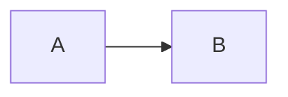

# Confluence Mermaid 동작 방식 분석

- 분석 대상: <https://pms-innogrid.atlassian.net/wiki/spaces/PAAS/pages/2177630217/DevOpsit+CCP>
- 분석 일자: 2026-08-11 (Asia/Seoul)
- 분석 범위: 대상 페이지의 Mermaid 매크로 저장 구조, 편집 UX, 조회 화면 렌더링 방식, 오류 처리
- 분석 방법: 로그인된 Chrome에서 조회·편집 화면과 Forge iframe을 관찰하고, 동일 페이지의 ADF를 교차 확인했다.

## 1. 결론

대상 Confluence 환경의 Mermaid는 Confluence 기본 코드 블록이 직접 다이어그램을 그리는 방식이 아니다. `Mermaid diagram`이라는 별도 Forge 매크로가 같은 페이지에 있는 코드 블록 하나를 선택하고, 선택한 코드 블록의 텍스트를 Mermaid 라이브러리로 변환해 SVG로 표시한다.

핵심 구조는 다음과 같다.

```text
ADF codeBlock 목록
  └─ codeBlock[n]의 일반 텍스트
       ↓ guestParams.index = n
ADF extension 노드: Mermaid diagram
       ↓ Confluence Forge 런타임
Atlassian CDN의 Custom UI iframe
       ↓ Mermaid 11.15.0
인라인 SVG 또는 문법 오류 화면
```

따라서 Markdown의 `mermaid` fence를 ADF `codeBlock` 하나로 변환하는 것만으로는 이 페이지에서 본 것과 같은 다이어그램이 되지 않는다. 코드 블록과 별도로 Forge 매크로 `extension` 노드가 필요하다.

## 2. 구성 요소

### 2.1 원본: 일반 ADF 코드 블록

Mermaid 매크로가 렌더링할 원문은 별도의 ADF `codeBlock`에 있다. 대상 페이지에는 총 11개의 코드 블록이 있고 언어는 대부분 `plaintext`, 하나는 `shell`로 저장되어 있었다.

중요한 점은 Mermaid 소스가 매크로의 ADF 노드 안에 중복 저장되지 않는다는 것이다. 매크로는 코드 블록의 텍스트를 직접 가지지 않고 코드 블록 목록의 순번만 가진다.

### 2.2 렌더러: Forge extension 노드

대상 페이지에는 아래 식별자를 사용하는 `extension` 노드가 두 개 있다.

| 항목 | 확인값 |
| --- | --- |
| ADF node type | `extension` |
| extension type | `com.atlassian.ecosystem` |
| extension title | `Mermaid diagram` |
| Forge 환경 | `PRODUCTION` |
| Forge app ID | `23392b90-4271-4239-98ca-a3e96c663cbb` |
| module ID | `63d4d207-ac2f-4273-865c-0240d37f044a` |
| extension module | `static/mermaid-diagram` |

저장 형태를 필요한 필드만 남겨 단순화하면 다음과 같다.

```json
{
  "type": "extension",
  "attrs": {
    "layout": "default",
    "extensionType": "com.atlassian.ecosystem",
    "extensionKey": "23392b90-4271-4239-98ca-a3e96c663cbb/63d4d207-ac2f-4273-865c-0240d37f044a/static/mermaid-diagram",
    "text": "Mermaid diagram",
    "parameters": {
      "guestParams": {
        "index": 8
      },
      "forgeEnvironment": "PRODUCTION",
      "extensionTitle": "Mermaid diagram"
    },
    "localId": "63f13912-e5c4-47ce-9c47-bb485fab29c1"
  }
}
```

실제 ADF에는 Confluence 페이지·스페이스·Forge 실행 문맥도 포함되지만 위 구조가 Mermaid 선택과 렌더링을 설명하는 핵심이다.

### 2.3 코드 블록 연결 방식

`parameters.guestParams.index`는 페이지 안 코드 블록 목록의 0부터 시작하는 순번이다.

| Mermaid 매크로 | `guestParams.index` | 편집 화면 표시 | 실제 참조 대상 |
| --- | ---: | --- | --- |
| 첫 번째 | `8` | `9. git init ...` | 아홉 번째 `shell` 코드 블록 |
| 두 번째 | `9` | `10. SVC ...` | 열 번째 `plaintext` 코드 블록 |

ADF의 index와 편집 화면의 번호·원문이 정확히 일치하므로 0-based index임을 확인할 수 있다. 코드 블록 `localId`를 참조하는 방식은 아니다.

이 방식은 코드 블록을 매크로보다 앞쪽에 추가하거나 순서를 변경했을 때 기존 index가 다른 블록을 가리킬 가능성이 있다. 실제 재정렬 후 보정 여부는 이번 조사에서 변경 테스트를 하지 않았으므로 별도 검증이 필요하다.

## 3. 편집 화면 동작

Confluence 편집기에서는 매크로가 `Mermaid diagram`이라는 extension 노드로 표시된다. 매크로를 선택하면 다음 플로팅 도구가 나타난다.

- 편집
- 정렬
- 복사
- 제거

`편집`을 누르면 같은 Forge 앱의 Custom UI iframe이 열리고 다음 설정을 제공한다.

- `Select codeblock with mermaid diagram to render` 선택 상자
- `Auto detect`
- 현재 페이지의 모든 코드 블록 목록
- `Submit`
- `Cancel`

설정 화면에는 다음 안내가 표시된다.

- Auto detect는 가장 가까운 다이어그램을 기본 선택한다.
- Mermaid 다이어그램으로 인식되지 않는 항목은 흐리게 표시한다.

대상 페이지에서는 첫 번째 매크로가 아홉 번째 코드 블록을 명시적으로 선택하고 있었다. 즉, 매크로 편집기는 페이지의 코드 블록을 수집하고 사용자가 고른 순번을 `guestParams.index`로 저장한다.

## 4. 조회 화면 렌더링

조회 화면에서 Confluence ADF renderer는 `extension` 노드를 일반 본문 HTML로 직접 그리지 않는다. 다음 구조로 Forge 앱을 호스팅한다.

```text
.ak-renderer-extension
  └─ [data-testid="ForgeExtensionContainer"]
       └─ [data-testid="hosted-resources-iframe"]
            └─ Mermaid Custom UI
```

확인된 iframe 특성은 다음과 같다.

- `data-forge-iframe="true"`
- Atlassian 개발 CDN의 `custom-ui` 리소스를 로드
- 앱 식별자는 ADF의 Forge app ID와 동일
- `global-bridge.js`를 로드해 Forge host와 통신
- `iframeResizer.contentWindow.min.js`로 내용 높이를 맞춤
- 앱 전용 JavaScript와 Atlaskit token stylesheet를 로드
- iframe 안에서 결과 SVG를 생성

iframe은 `allow-scripts`, `allow-same-origin`, `allow-forms`, `allow-downloads` 등이 포함된 sandbox로 분리되어 있다. 따라서 Mermaid 실행 주체는 Confluence 본문 renderer가 아니라 Forge iframe 안의 앱이다.

## 5. Mermaid 렌더링과 오류 처리

iframe 안에서 확인된 Mermaid 버전은 `11.15.0`이다. 정상 소스라면 앱이 Mermaid 결과를 인라인 SVG로 만든다.

대상 페이지의 두 매크로는 모두 현재 오류 상태다.

| 매크로 | 선택된 텍스트 | 결과 |
| --- | --- | --- |
| 첫 번째 | Git 초기화 shell 명령 | Mermaid diagram type을 찾지 못함 |
| 두 번째 | `SVC`, `PROJECT`로 시작하는 ASCII 트리 | Mermaid diagram type을 찾지 못함 |

화면에는 `Error while loading diagram`, `No diagram type detected...`, `Syntax error in text`, `mermaid version 11.15.0`이 표시된다.

이는 Forge iframe 자체가 로드되지 않은 오류가 아니다. 앱과 Mermaid 런타임은 정상 로드됐지만, 선택된 코드 블록이 `flowchart`, `sequenceDiagram` 등 Mermaid가 인식할 수 있는 diagram 선언으로 시작하지 않아 파싱에 실패한 상태다.

## 6. 전체 처리 흐름

### 6.1 작성·저장

```text
사용자가 페이지에 코드 블록 작성
  → Mermaid diagram 매크로 삽입
  → 매크로 편집기에서 코드 블록 선택 또는 Auto detect
  → 선택 결과를 codeBlock 순번으로 저장
  → Confluence ADF에 codeBlock과 extension을 각각 저장
```

### 6.2 조회

```text
Confluence가 페이지 ADF 조회
  → extension node를 Forge 앱으로 해석
  → guestParams.index로 대상 codeBlock 결정
  → Forge Custom UI iframe 실행
  → 코드 블록 텍스트를 Mermaid 11.15.0에 전달
  → 성공하면 SVG, 실패하면 오류 UI 표시
```

## 7. Inno Extension에 미치는 영향

### 7.1 Markdown -> ADF 변환

Markdown 입력에 다음 fence가 있다고 가정한다.

````markdown

````

이를 ADF `codeBlock`으로만 변환하면 Confluence에는 코드가 보이지만 대상 환경의 Mermaid 앱이 자동으로 생성되지는 않는다. 같은 결과를 만들려면 최소한 다음 두 노드가 필요하다.

1. Mermaid 원문을 담은 ADF `codeBlock`
2. 해당 코드 블록의 최종 순번을 `guestParams.index`로 가진 Mermaid `extension`

다만 Forge app ID와 module ID를 하드코딩해 외부 앱 macro를 직접 생성하는 방식은 다음 위험이 있다.

- 해당 Confluence 사이트에 앱이 설치되어 있어야 한다.
- extension key와 매크로 parameter 계약은 앱 버전에 따라 바뀔 수 있다.
- 코드 블록 순번은 문서 병합 과정에서 다시 계산해야 한다.
- Confluence가 생성하는 embedded macro context를 임의로 구성하는 것은 공개 계약인지 확인되지 않았다.
- 앱이 없는 사이트에서는 알 수 없는 extension으로 남거나 렌더링에 실패할 수 있다.

따라서 기본 동작은 Mermaid fence를 손실 없이 코드 블록으로 보존하고, 앱 매크로 자동 생성은 사이트·앱 버전을 검증한 실험 기능으로 분리하는 편이 안전하다.

### 7.2 Confluence -> Markdown 내보내기

내보내기에서는 Mermaid extension을 일반 알 수 없는 앱 노드로 버리지 않고 다음 방식으로 해석할 수 있다.

1. extension key가 조사된 Mermaid macro인지 확인한다.
2. `guestParams.index`를 읽는다.
3. 같은 문서의 해당 codeBlock을 찾는다.
4. 코드 블록 내용을 `mermaid` fence로 내보낸다.
5. 참조된 원본 codeBlock을 다시 일반 코드 블록으로 출력하지 않아 중복을 피한다.

index가 범위를 벗어나거나 대상 codeBlock이 Mermaid 문법이 아니면 원문 코드 블록은 보존하고 경고를 남기는 편이 안전하다.

## 8. 확인된 사실과 추론의 경계

### 확인된 사실

- Mermaid는 ADF `extension` 노드와 Forge Custom UI iframe으로 동작한다.
- 원문은 별도 ADF `codeBlock`에 있다.
- 매크로는 `guestParams.index`로 코드 블록을 참조한다.
- index는 0부터 시작한다.
- 편집 UI는 Auto detect와 전체 코드 블록 선택을 제공한다.
- 조회 iframe은 Mermaid `11.15.0`으로 SVG 또는 오류 SVG를 만든다.
- 대상 페이지의 두 매크로는 Mermaid 문법이 아닌 코드 블록을 가리켜 오류가 발생한다.

### 추가 검증이 필요한 부분

- Auto detect가 거리 외에 어떤 기준으로 Mermaid 문법을 판별하는지
- 코드 블록 삽입·삭제·재정렬 시 저장된 index를 앱이 자동 보정하는지
- REST API로 외부 앱 extension을 새로 작성하는 방식이 공식 지원 계약인지
- 앱 업데이트 시 extension key, parameter, Mermaid 버전의 호환성

## 9. 구현 판단

현재 기준으로는 Mermaid를 Confluence의 기본 ADF 기능으로 취급하면 안 된다. 이 사이트에 설치된 특정 Forge 앱의 macro 계약으로 취급해야 한다.

Inno Extension의 안정적인 1차 정책은 다음과 같다.

1. Markdown import 시 Mermaid 원문을 코드 블록으로 보존한다.
2. 현재의 무API content script에서는 Confluence Mermaid macro를 자동 생성하지 않는다.
3. Mermaid 문법 후보 탐지는 가능하지만, Forge 앱의 cross-origin 설정 iframe을 완료하거나 공개 paste 계약으로 extension node를 생성할 수 없으므로 탐지 결과만으로 자동 변환 완료를 보장할 수 없다.
4. 향후 공개 API나 검증된 editor extension 계약을 채택한다면 현재 페이지 전체 codeBlock 순번을 다시 계산하고, 앱 식별자나 parameter가 달라질 때 일반 코드 블록으로 폴백해야 한다.

### 9.1 2026-08-11 편집 화면 재검토

로그인된 `edit-v2` 화면에서 현재 본문을 다시 확인한 결과, 편집기에는 13개의 `codeBlock` node가 있었고 그중 `flowchart LR`로 시작하는 Mermaid source 후보가 2개 있었다. 후보 탐지는 코드 블록 원문의 첫 유효 줄로 안정적으로 수행할 수 있다.

하지만 편집 DOM에는 이 두 source와 연결된 Mermaid `extension` node가 없었고, 페이지의 Forge iframe은 외부 앱 origin에서 실행됐다. Chrome extension content script는 동일 출처 정책 때문에 그 iframe 내부의 코드 블록 선택과 `Submit`을 직접 조작할 수 없다. Confluence slash menu로 매크로를 띄우는 데 성공하더라도 자동 설정 완료 단계가 남는다.

따라서 이미 ADF인 본문에 대해 가능한 범위는 다음처럼 구분한다.

- 가능: Mermaid 선언으로 시작하는 코드 블록 후보 탐지, 개수·위치 안내, source 보존
- 조건부 가능: 사용자가 Forge 설정 화면을 마무리하는 보조 삽입 흐름
- 현재 불가: API나 비공개 editor state 주입 없이 모든 후보를 Mermaid 매크로로 완전 자동 변환
