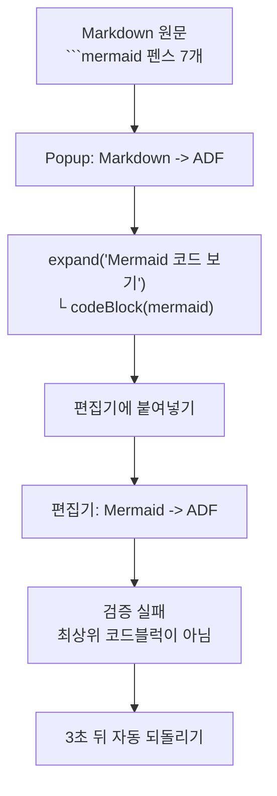

# Popup `Markdown -> ADF` 결과는 `Mermaid -> ADF`로 변환할 수 없다

- 최초 관측: 2026-09-02
- 원인 확정: 2026-09-04 (사용자가 원문 Markdown 제공)
- 상태: **원인 확정 · 수정 적용 · 실측 확인 완료(2026-09-04).** 다만 이 수정 후 [별개의 원인](./2026-09-04-mermaid-verification-reads-truncated-dom.md)이 드러났다
- 대상 문서: 개인 스페이스 `에러 테스트` 페이지 `edit-v2/2246476007`
- 신고 내용: 편집 중 `Mermaid -> ADF`가 `변환 중` → `실패`로 끝난다. 사용자 최초 추정은 "내용이 길어서"

## 1. 결론

**문서 길이와 무관하다. 사용자 잘못도 아니다.**

Popup의 `Markdown -> ADF`는 Mermaid 코드블럭을 **`expand` 안에 넣어서** 출력한다. 편집기의 `Mermaid -> ADF`는 코드블럭이 **최상위에 있을 때만** 변환에 성공한다.

**즉 Popup 변환 결과를 편집기에서 `Mermaid -> ADF`로 처리하는 것은 구조적으로 불가능하다.** 이 문서만의 문제가 아니라 Mermaid를 포함한 모든 Popup 변환 결과에서 **100% 재현된다.**



## 2. 근본 원인 — 코드

`src/sites/confluence/adf/markdown-to-adf.ts:110`

```ts
private renderMermaidBlock(text: string): AdfNode[] {
  this.mermaidCount += 1;
  return [{
    type: 'expand',
    attrs: { title: 'Mermaid 코드 보기' },
    content: [this.codeBlock(text, 'mermaid')],
  }];
}
```

`src/sites/confluence/features/editorMarkdownToAdf/runtime.ts:339`

```ts
function findEditorTopLevelNode(editor: HTMLElement, node: HTMLElement): HTMLElement | null {
  let current = node;
  while (current.parentElement && current.parentElement !== editor) {
    current = current.parentElement;
  }
  return current.parentElement === editor ? current : null;
}
```

앞의 함수가 코드블럭을 `expand` 안에 넣고, 뒤의 함수는 그것이 최상위임을 전제한다. **두 기능이 같은 저장소 안에서 정반대 가정을 하고 있다.**

### 2.1 spec에도 모순이 그대로 적혀 있다

`spec/features/confluence-adf-markdown-tools.md`

| 줄 | 내용 |
| --- | --- |
| 106 | "Popup의 Markdown 변환 결과에서 Mermaid fenced code block은 Mermaid 앱 매크로가 아니라 **`expand` 안의 `codeBlock(language: mermaid)`로 보존**한다" |
| 76 | "source가 `expand` 안에 있고 그 **top-level node 바로 앞이 동일 Mermaid extension인 경우만** 이미 변환된 정상 pair로 본다" |

106줄이 만드는 구조는 76줄의 조건을 만족할 수 없다. Popup 출력에는 앞선 Mermaid extension이 없기 때문이다. **명세 단계에서 이미 어긋나 있었다.**

Popup이 expand로 감싼 이유는 106줄에 적혀 있다 — Popup은 tenant나 페이지 문맥을 몰라 서드파티 Mermaid 앱 렌더링을 보장할 수 없어서다. 의도 자체는 타당하지만, 그 결과물을 편집기 기능이 이어받지 못한다는 점이 검토되지 않았다.

## 3. 원문에서 확인한 것

사용자가 제공한 Markdown 원문의 ` ```mermaid ` 펜스는 **7개**다.

| 위치 | 종류 |
| --- | --- |
| §2.1 | `flowchart LR` |
| §2.2 | `flowchart LR` |
| §2.3 | `sequenceDiagram` |
| §5 | `flowchart TD` |
| §6.1 | `flowchart TD` |
| §6.4 | `flowchart LR` |
| §7 | `gantt` |

**편집기에서 측정한 `mermaidCodeBlockCount: 7`과 정확히 일치한다.** 그리고 편집기의 expand도 7개였다. 즉 **Mermaid 펜스 1개당 expand 1개**가 만들어졌다 — Popup이 감싼 결과다.

## 4. 편집기 상태 측정값

| 항목 | 값 |
| --- | --- |
| 코드블럭 | 18 |
| Mermaid 코드블럭 | **7** |
| Mermaid 원문 길이 | 279~631자 |
| expand | **7** |
| **Mermaid 컴포넌트** | **0** |
| Mermaid 코드블럭이 expand 안인가 | **7/7 예** |
| 직전 최상위가 Mermaid extension인가 | **7/7 아니오** |
| `data-local-id` 누락 | 0 |
| `.cm-content` 누락 | 0 |
| 브리지 설치 | `true` |

expand 제목은 전부 `Mermaid 코드 보기`였다. 이것이 Popup 변환기가 쓰는 제목이다 (`markdown-to-adf.ts:115`). 편집기 변환기가 쓰는 제목은 `Mermaid 원본`(`CONFLUENCE_MERMAID_SOURCE_TITLE`)으로 서로 다르다.

## 5. 실행 중 DOM 변화

변환 버튼을 누르고 60ms 간격으로 관측했다.

| 시각 | 라벨 | 컴포넌트 | expand | 코드블럭 | 실행취소 |
| --- | --- | --- | --- | --- | --- |
| 1ms | 유휴 | 0 | 7 | 18 | 비활성 |
| **1,362ms** | 변환 중 | **1** | **8** | **19** | **활성** |
| **4,360ms** | 변환 중 | **0** | **7** | **18** | 비활성 |
| 14,379ms | 유휴 | 0 | 7 | 18 | 비활성 |

1. `1,362ms` — **붙여넣기가 실제로 적용됐다.** 느려서 못 한 것이 아니다.
2. `4,360ms` — 정확히 3,000ms 뒤 복구됐다. `MERMAID_EXTENSION_INSERT_TIMEOUT_MS`가 3,000ms다.
3. 첫 대상에서 예외가 던져져 나머지 6개는 시도되지 않았다.

**실패 지점은 붙여넣기가 아니라 그 뒤의 검증이다.**

### 5.1 붙여넣기 직후 위치 측정

| 항목 | 값 |
| --- | --- |
| 새 extension이 expand 안에 있는가 | **`true`** |
| 최상위 노드의 `data-prosemirror-node-name` | **없음** (아래 참조) |
| `nestedExpand` 수 | **1** |
| 일반 `expand` 수 | 7 |

**측정 표기 정정.** 최초 관측에서 이 항목을 `findEditorTopLevelNode = null`로 적었으나 **틀렸다.**
측정 스크립트가 최상위 노드의 `data-prosemirror-node-name` 속성을 읽었는데, 그 값이 없어서 `null`이 나온 것을
함수 반환값이 `null`인 것으로 오독했다. 조상 체인을 다시 뜨니 실제 구조는 이렇다.

```text
codeBlock
└ .ak-editor-expand__content
  └ expand                            data-prosemirror-node-name="expand"
    └ .fabric-editor-breakout-mark-dom
      └ .fabric-editor-breakout-mark  ← 편집기 직계 자식 (pmNode 속성 없음)
```

`findEditorTopLevelNode()`는 `null`이 아니라 **`.fabric-editor-breakout-mark` 래퍼**를 돌려준다.
따라서 검증이 실패하는 진짜 지점은 첫 조건이 아니라 **형제 비교**다.

Confluence 스키마상 expand는 중첩될 수 없다. 그래서 새로 넣은 `expand`가 **`nestedExpand`로 강등**됐다.

검증 함수는 다음을 요구한다.

```ts
const extensionTopLevel = findEditorTopLevelNode(editor, extension);
const sourceTopLevel = findEditorTopLevelNode(editor, codeBlock);
return Boolean(
  extensionTopLevel
  && sourceTopLevel
  && extensionTopLevel.nextElementSibling === sourceTopLevel,
);
```

붙여넣기가 기존 expand **안쪽**에서 일어나므로 새 extension과 원본 코드블럭이 **같은 breakout 래퍼**에 갇힌다.
`extensionTopLevel`과 `sourceTopLevel`이 같은 요소가 되어 `extensionTopLevel.nextElementSibling === sourceTopLevel`은
"자기 다음 형제가 자기 자신"을 묻는 셈이 되고, **항상 거짓이다.**

**타이밍 문제가 아니라 논리적으로 통과 불가다.**

### 5.2 성공 문서와의 대조

[이전 조사](../confluence-mermaid-adf-conversion-failure-analysis.md) 5절에 성공 경로 실측이 있다.

| 항목 | 성공 (`2202566692`) | 실패 (`2246476007`) |
| --- | --- | --- |
| 변환 전 expand 수 | **0** | **7** |
| Mermaid 코드블럭이 expand 안인가 | 아니오 | **예 (7/7)** |
| 코드블럭 수 변화 | 22 → **22** | 18 → **19** |
| 코드블럭 총수 | 22 | **18 (더 작음)** |
| 결과 | `2개 변환` | 실패 후 자동 복구 |

코드블럭 수 변화가 핵심이다. 정상 동작은 선택한 코드블럭을 `extension + expand(원본)`으로 **교체**하므로 원본이 새 expand로 이동할 뿐 총수가 22로 유지된다. 실패 문서는 18에서 **19로 늘었다** — 원본이 제자리에 남은 채 사본이 하나 더 생겼다는 뜻이다. **교체가 아니라 삽입이 일어났다.**

성공 문서의 변환 전 expand가 **0개**라는 점이 결정적이다. 그 문서는 Mermaid 코드블럭이 최상위에 있었다.

## 6. 길이 가설을 배제하는 근거

| 근거 | 내용 |
| --- | --- |
| 붙여넣기가 성공함 | 1,362ms에 적용됐다 |
| 실패까지 정확히 3,000ms | 타임아웃 상수와 일치. "아직 안 됐다"가 아니라 "영원히 안 된다" |
| 문서가 더 작음 | 코드블럭 18개. 정상 변환된 문서는 **22개**였다 |
| Mermaid 원문이 짧음 | 279~631자. 이전 문서는 362자, 320자 |
| 원인이 코드에서 확인됨 | 2절. 길이와 무관한 구조 문제 |

**오히려 이전에 성공한 문서보다 작다.**

## 7. 2026-09-02 1차 분석의 오류 정정

원문을 받기 전 작성한 1차 분석에는 틀린 단정이 있었다.

> "제목이 다르다. **이 expand들은 확장이 만든 것이 아니라 문서 작성 시점부터 있던 것이다.** 확장의 과거 변환 잔여물이 아니다."

**틀렸다.** expand 제목이 편집기 변환기의 `Mermaid 원본`과 다르다는 것만 보고 "확장 밖에서 만들어졌다"고 단정했는데, 같은 저장소의 **Popup 변환기**가 `Mermaid 코드 보기`라는 다른 제목을 쓴다는 사실을 확인하지 않았다.

`grep -rn "코드 보기" src/` 한 번이면 드러났을 내용이다. 두 변환기가 서로 다른 expand 제목을 쓴다는 전제를 검증하지 않고 한쪽만 보고 결론을 냈다.

이 오류 때문에 원인을 "사용자 문서 구조"로 돌렸고, **우리 기능 두 개의 모순이라는 진짜 원인을 놓쳤다.** 대응 방향도 그만큼 어긋나 있었다.

두 번째 오류는 5.1절에 적었다. `findEditorTopLevelNode()`가 `null`을 돌려준다고 썼으나, 실제로는
`.fabric-editor-breakout-mark` 래퍼를 돌려준다. 측정 스크립트가 읽은 것은 함수 반환값이 아니라 그 요소의
`data-prosemirror-node-name` 속성이었고, 래퍼에 그 속성이 없어 `null`이 나온 것이다. **측정값의 의미를 확인하지
않고 그대로 결론에 옮겼다.** 결론(검증 통과 불가)은 같지만 근거로 든 지점이 틀렸다.

## 8. 확인하지 못한 것

- **실패 라벨 문구 전문.** 60ms 간격 샘플링으로도 잡지 못했다. 사용자는 `변환 중` → `실패` 전이를 육안으로 확인했으나 원인 접미사(`· 교체 확인 실패`)까지는 보고되지 않았다.
- 4,360ms 복구 → 14,379ms 유휴 사이 10초 공백. 되돌리기 완료 후 1.5초면 유휴가 되어야 하는데 설명하지 못했다.
- 원문의 **비Mermaid 코드블럭 개수**를 세어 18과 대조하지는 못했다. Mermaid 7개 일치만 확인했다.

## 9. 적용한 수정 (2026-09-04)

A와 B를 함께 적용했다. A는 앞으로 만들 문서를, B는 이미 만들어진 문서를 구제한다.

### A. Popup이 expand로 감싸지 않는다

`src/sites/confluence/adf/markdown-to-adf.ts`

```ts
private renderMermaidBlock(text: string): AdfNode[] {
  this.mermaidCount += 1;
  return [this.codeBlock(text, 'mermaid')];   // 이전: expand('Mermaid 코드 보기')로 감쌌다
}
```

expand의 목적은 다이어그램이 생긴 *뒤에* 원본을 접는 것이고, 그 접기는 편집기 변환이 `Mermaid 원본`
expand로 직접 만든다. 다이어그램이 없는 시점에 미리 접을 이유가 없었다.

### B. 편집기가 expand를 통째로 교체 단위로 삼는다

`src/sites/confluence/features/editorMarkdownToAdf/runtime.ts`

```ts
function resolveMermaidReplacementTarget(editor, codeBlock): HTMLElement {
  const expand = codeBlock.closest<HTMLElement>(EDITOR_EXPAND);
  if (!expand || !editor.contains(expand)) return codeBlock;

  const innerNodes = Array.from(expand.querySelectorAll<HTMLElement>('[data-prosemirror-node-name]'));
  return innerNodes.length === 1 && innerNodes[0] === codeBlock ? expand : codeBlock;
}
```

`selectEditorNode(editor, codeBlock)` 자리에 이 함수 결과를 넣었다.

**코드블럭이 expand 안에 홀로 있을 때만** expand를 교체한다. 다른 내용이 함께 든 expand는 건드리지 않는다 —
통째로 교체하면 그 내용이 사라지기 때문이다. 그 경우는 종전대로 실패하고 되돌아간다. **내용을 잃는 것보다 낫다.**

이 가드가 실제로 성립하는지는 대상 문서에서 확인했다. expand 7개 모두 `innerNodeNames: ["codeBlock"]`으로
코드블럭 하나만 들어 있었다.

### 채택하지 않은 것

| 후보 | 이유 |
| --- | --- |
| C. expand 안 코드블럭을 대상에서 제외하고 이유 표시 | 실패는 안 하지만 변환도 안 된다. B가 실제로 변환해 준다 |
| D. 검증 조건을 완화해 같은 부모 안 형제도 허용 | 검증이 막던 것이 바로 중첩된 잘못된 결과다. 완화하면 그 결과를 저장하게 된다 |

### 검증 상태

| 항목 | 상태 |
| --- | --- |
| `npm run typecheck` | 통과 |
| `npm test` (83개) | 통과 |
| `npm run build` | 통과 |
| A 단위 테스트 | 추가 — 최상위 `codeBlock` 출력 + expand 미포함 회귀 가드 |
| **B의 실제 tenant 동작** | **확인 완료(2026-09-04).** 대상 문서에서 expand 0개, 변환 중 코드블럭 수 18 → 18 유지(정상 교체)를 실측했다 |

## 10. 부수적으로 드러난 것

| 항목 | 내용 |
| --- | --- |
| 실패까지 오래 걸린다 | 첫 대상에서 3초 타임아웃 + 되돌리기 대기 |
| 진행 표시가 없다 | 14초 동안 `변환 중`만 떠 있어 멈춘 것처럼 보인다 |
| 실패 원인이 안 보인다 | 라벨이 1.5초만 뜨고 사라져 사용자도 원인 문구를 못 봤다 |
| 두 변환기의 expand 제목이 다르다 | `Mermaid 코드 보기`(Popup) vs `Mermaid 원본`(편집기). 통일하거나 최소한 문서화가 필요하다 |

## 11. 검증 중 문서 변경

분석 과정에서 변환을 여러 차례 실행했고 모두 자동 되돌리기로 복구됐다. 마지막에 상태를 직접 확인했다.

```text
컴포넌트 0, expand 7, nestedExpand 0, 코드블럭 18, 실행취소 비활성
```

원래 상태와 동일하다. **발행하지 않았다.**

## 12. 관련 자료

- [Confluence Mermaid -> ADF 변환 실패 분석](../confluence-mermaid-adf-conversion-failure-analysis.md) — 2026-08-24 조사. 당시 6절 가설 2번(3,000ms 검증 미통과)이 이번에 확정됐다. 다만 원인은 그때 추정한 "문서가 크고 저사양"이 아니었다
- `src/sites/confluence/adf/markdown-to-adf.ts` — `renderMermaidBlock()` (원인)
- `src/sites/confluence/features/editorMarkdownToAdf/runtime.ts` — `findEditorTopLevelNode()`, `isMermaidReplacementAtOriginalPosition()`
- `src/sites/confluence/features/editorMarkdownToAdf/mermaid.ts` — `CONFLUENCE_MERMAID_SOURCE_TITLE`
- `spec/features/confluence-adf-markdown-tools.md` — 76줄과 106줄이 서로 모순
