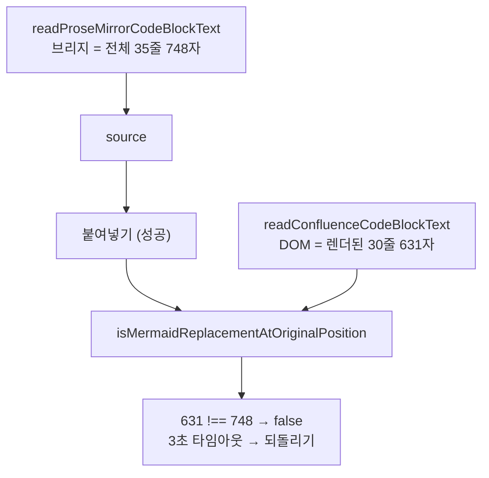

# 30줄 넘는 코드블럭은 Mermaid 변환 검증을 통과할 수 없다

- 발생일: 2026-09-04
- 상태: **원인 확정 · 수정 적용 · 실측 확인 완료(2026-09-04)**
- 대상 문서: 개인 스페이스 `에러 테스트` 페이지 `edit-v2/2246476007`
- 선행 이슈: [Popup `Markdown -> ADF` 결과는 `Mermaid -> ADF`로 변환할 수 없다](./2026-09-02-mermaid-conversion-fails-inside-expand.md) — 그 수정 적용 **후에도** 실패해서 다시 조사했다

## 1. 결론

**사용자의 최초 추정 "내용이 길어서"가 맞았다.** 다만 문서 전체 길이가 아니라 **개별 코드블럭의 줄 수**다.

CodeMirror는 코드블럭을 **최대 30줄까지만 DOM에 렌더한다.** 그런데 변환 코드는

- 붙여넣을 **원문은 ProseMirror**에서 읽고 (전체)
- 교체 결과 **검증은 DOM**에서 읽어 (30줄까지) 그 둘이 같은지 비교한다

31줄 이상인 코드블럭에서는 이 둘이 절대 같아질 수 없다. **검증이 논리적으로 통과 불가다.**



## 2. 선행 수정은 실제로 동작했다

2026-09-02 이슈의 A·B 수정을 적용한 뒤 측정한 결과다.

| 항목 | 수정 전 | **수정 후** |
| --- | --- | --- |
| `Mermaid 코드 보기` expand | 7 | **0** |
| Mermaid 코드블럭이 expand 안인가 | 7/7 예 | **0/7** |
| 변환 중 코드블럭 수 변화 | 18 → **19** (삽입) | 18 → **18** (교체) |

코드블럭 수가 유지된다는 것은 **정상적인 교체가 일어났다**는 뜻이다. 성공 문서(22 → 22)와 같은 거동이다. 구조 문제는 해결됐고, 남은 것은 검증 하나다.

## 3. 실측 — CodeMirror는 30줄에서 끊는다

`edit-v2` 편집기의 코드블럭 18개를 DOM 읽기와 ProseMirror 원문으로 각각 읽어 대조했다.

| 코드블럭 | 렌더된 줄 | 실제 줄 | DOM 길이 | PM 길이 | 일치 |
| --- | --- | --- | --- | --- | --- |
| 0 | 13 | 13 | 351 | 351 | 예 |
| 1 | 17 | 17 | 430 | 430 | 예 |
| **2** | **30** | **33** | **604** | **658** | **아니오** |
| 10 | 13 | 13 | 340 | 340 | 예 |
| 11 | 28 | — | 715 | 901 | **아니오** |
| 15 | 15 | 15 | 279 | 279 | 예 |
| 16 | 17 | 17 | 393 | 393 | 예 |
| **17** | **30** | **35** | **631** | **748** | **아니오** |

18개 중 **3개가 어긋난다.** 어긋나는 것은 전부 실제 줄 수가 30을 넘는 블록이고, 렌더된 줄은 **30에서 멈춘다.**

### 3.1 잘려나가는 지점

코드블럭 2번의 두 문자열을 문자 단위로 대조했다.

```text
첫 불일치 위치: 604   (= DOM 길이. 즉 DOM은 PM의 접두사다)

DOM 끝  : ... SEC-->>FE: DryRunEsoResourceResponse (동기)
PM 계속 : ... SEC-->>FE: DryRunEsoResourceResponse (동기)
          ␊    SEC->>SE: POST .../externalsecrets (실제 생성, 비동기)
          ␊
```

DOM 30줄 / PM 33줄. **마지막 3줄이 통째로 없다.** 줄 중간이 잘리는 것이 아니라 줄 단위로 렌더되지 않는다.

### 3.2 스크롤로 해결되지 않는다

뷰포트 문제인지 확인하려고 해당 블록을 화면 중앙으로 스크롤한 뒤 다시 읽었다.

| 시점 | 렌더된 줄 | DOM 길이 |
| --- | --- | --- |
| 스크롤 전 | 30 | 604 |
| **블록을 화면 중앙으로 스크롤 후** | **30** | **604** |

**변화 없다.** 페이지 스크롤과 무관한 CodeMirror 내부 제한이다.

## 4. 코드에서의 경로

`src/sites/confluence/features/editorMarkdownToAdf/runtime.ts`

**원문을 읽는 쪽 — ProseMirror (전체)**

```ts
// 145행: 기본 readSource
readSource: (editor, codeBlock) => Promise<string> = readProseMirrorCodeBlockText,
// 113행: 브리지로 ProseMirror node의 실제 텍스트를 읽는다
const response = await requestProseMirrorBridge(editor, 'read-node', codeBlock);
```

**검증하는 쪽 — DOM (30줄까지)**

```ts
// 385행 matchesMermaidSourceAtIndex
&& readConfluenceCodeBlockText(codeBlock) === source

// 399행 isMermaidReplacementAtOriginalPosition
|| readConfluenceCodeBlockText(codeBlock) !== source
```

`code-block.ts`

```ts
export function readConfluenceCodeBlockText(codeBlock: HTMLElement): string {
  const lines = Array.from(codeBlock.querySelectorAll<HTMLElement>('.cm-content .cm-line'));
  if (lines.length > 0) return lines.map((line) => line.textContent ?? '').join('\n');
  ...
}
```

`.cm-line`은 **렌더된 줄만** 존재한다. 31줄 이상이면 여기서 읽은 값이 `source`보다 짧고, 등호 비교는 영원히 거짓이다.

## 5. 실행 추적

변환 버튼을 누르고 50ms 간격으로 관측했다.

| 시각 | 라벨 | 컴포넌트 | expand | 코드블럭 | 실행취소 |
| --- | --- | --- | --- | --- | --- |
| 0ms | 유휴 | 0 | 0 | 18 | 비활성 |
| **751ms** | 변환 중 | **1** | **1** | **18** | **활성** |
| **4,750ms** | 변환 중 | 0 | 0 | 18 | 비활성 |

1. `751ms` — `extension + expand`가 정상 생성됐고 **코드블럭 수가 18로 유지**됐다. 교체가 제대로 일어났다.
2. `4,750ms` — 4,000ms 뒤 되돌려졌다. 3,000ms 검증 타임아웃 + 되돌리기 대기다.

후보는 뒤에서부터 처리하므로(`candidates.reverse()`) **35줄짜리 17번이 가장 먼저** 시도되고 거기서 바로 실패한다.

## 6. 이전 조사의 오판 정정

[2026-08-24 분석](../confluence-mermaid-adf-conversion-failure-analysis.md) 4.4절은 이렇게 단정했다.

> "뷰포트에 하나도 없는데 22개 전부 렌더돼 있다. **이 편집기는 코드블럭을 가상화하지 않는다.**"

**부분적으로 틀렸다.** 그 측정은 *코드블럭 자체*가 렌더되는지만 봤고, *블록 안의 줄*이 전부 렌더되는지는 보지 않았다. 그 문서의 Mermaid 블록은 6줄·5줄이라 30줄 한계에 닿을 일이 없었다.

정확히는 이렇다.

| 대상 | 가상화 |
| --- | --- |
| 코드블럭 노드 | **없음** — 화면 밖 블록도 전부 렌더된다 (기존 관측 유효) |
| 코드블럭 **안의 줄** | **있음** — 30줄에서 끊긴다 (이번에 확인) |

또한 필자는 2026-09-02 분석에서 사용자의 "내용이 길어서" 추정을 **"길이와 무관하다"고 단정했다. 그것도 틀렸다.** 그때 본 문서의 실패 원인이 expand 중첩이었던 것은 맞지만, 그 아래에 길이에서 비롯된 두 번째 원인이 깔려 있었고 그것을 보지 못했다. 첫 원인을 찾은 뒤 다른 원인을 더 찾지 않았다.

## 7. 확인하지 못한 것

- **30줄이 고정 상수인지, 창 크기·글꼴에 따라 달라지는지** 확인하지 못했다. 이번 환경에서 33줄·35줄 블록이 모두 정확히 30줄에서 끊긴 것만 관측했다. 28줄이 렌더된 11번 블록(901자)은 이 설명과 어긋나므로, 줄 수가 아니라 **렌더 높이**가 기준일 가능성이 있다.
- DOM 읽기가 항상 **접두사**인지 확인하지 못했다. 2번 블록에서는 접두사였고 스크롤해도 그대로였지만, 코드블럭 내부를 스크롤하면 중간 구간만 렌더될 수 있다.
- 실패 라벨 문구는 이번에도 잡지 못했다. 사용자가 `변환 중` → `실패` 전이를 확인했다.

## 8. 적용한 수정 (2026-09-04)

A안을 적용했다. 검증 비교를 렌더 잘림에 견디도록 완화한다.

`src/sites/confluence/features/editorMarkdownToAdf/runtime.ts`

```ts
export function matchesCodeBlockSource(codeBlock: HTMLElement, source: string): boolean {
  const domSource = readConfluenceCodeBlockText(codeBlock);
  if (!domSource) return source === '';
  return source === domSource || source.includes(domSource);
}
```

385·399행의 `readConfluenceCodeBlockText(codeBlock) === source` 등호 비교를 이 함수로 교체했다.

**왜 `includes`인가.** 실측에서 DOM 읽기는 원문의 접두사였지만, 블록 내부를 스크롤하면 가운데 구간만
렌더될 수 있다. 접두사만 허용하면 그 경우를 놓친다.

**왜 빈 문자열을 막는가.** 빈 문자열은 모든 원문의 부분 문자열이라, 아무것도 렌더되지 않은 코드블럭이
무조건 검증을 통과해 버린다. 그래서 `domSource`가 비면 `source`도 빈 경우에만 참으로 본다.

**오탐 위험.** 이 완화는 단독으로 쓰이지 않는다. `localId` 일치 · 접힌 expand 여부 · 직전 최상위 노드가
해당 extension인지가 함께 걸린다.

### 채택하지 않은 것

| 후보 | 이유 |
| --- | --- |
| B. 검증도 브리지로 ProseMirror 원문을 읽는다 | `waitForEditorChange`의 판정 함수가 동기라 구조 변경이 필요하다. A로 충분했다 |
| C. A로 통과시킨 뒤 브리지로 한 번 더 정확 비교 | A만으로 실측 통과. 필요해지면 그때 올린다 |
| D. DOM에서 전체를 읽는다 | 렌더되지 않은 줄은 DOM에 없다. 불가능 |

### 검증 결과 — 실제 tenant

대상 문서에서 `Mermaid -> ADF`를 실행한 뒤 측정했다.

| 항목 | 결과 |
| --- | --- |
| Mermaid 컴포넌트 | **7 / 7 생성** |
| expand 제목 | 전부 `Mermaid 원본` |
| `nestedExpand` | **0** |
| 코드블럭 수 | 18 → **18 유지** (정상 교체) |
| **모든 pair가 유효한가** | **예** — 7개 모두 직전 최상위 노드가 자기 extension |
| **잘렸던 블록의 변환 여부** | **변환됨** — 33줄(30줄 렌더), 35줄(30줄 렌더) 둘 다 성공 |
| 재실행 | `변환 대상 없음` · 문서 무변경 · 실행취소 비활성 (멱등) |

**이전에 실패를 일으키던 바로 그 두 블록(DOM이 30줄에서 잘리는 33줄·35줄)이 변환됐다.**

| 항목 | 상태 |
| --- | --- |
| `npm run typecheck` | 통과 |
| `npm test` (87개, +4) | 통과 |
| `npm run build` | 통과 |
| 실제 tenant 동작 | **확인 완료** |

## 9. 검증 중 문서 변경

원인 조사 단계에서 실행한 변환은 모두 자동 되돌리기로 복구했고 매번 원상태를 확인했다.

수정 적용 후의 검증에서는 변환이 **성공**해 문서가 변환된 상태로 남아 있다. 이는 되돌려야 할
오류가 아니라 사용자가 원래 하려던 작업의 결과다. 마지막에 재실행해 멱등성을 확인했고, 그 클릭은
문서를 바꾸지 않았다(`변환 대상 없음`, 실행취소 비활성).

**발행하지 않았다.** 발행 여부는 사용자가 판단한다.

## 10. 관련 자료

- [Popup `Markdown -> ADF` 결과는 `Mermaid -> ADF`로 변환할 수 없다](./2026-09-02-mermaid-conversion-fails-inside-expand.md) — 선행 원인. 수정 후 이 이슈가 드러났다
- [Confluence Mermaid -> ADF 변환 실패 분석](../confluence-mermaid-adf-conversion-failure-analysis.md) — 4.4절 결론을 6절에서 정정
- `src/sites/confluence/features/editorMarkdownToAdf/runtime.ts` — 385·399행이 수정 지점
- `src/sites/confluence/features/editorMarkdownToAdf/code-block.ts` — `readConfluenceCodeBlockText()`
