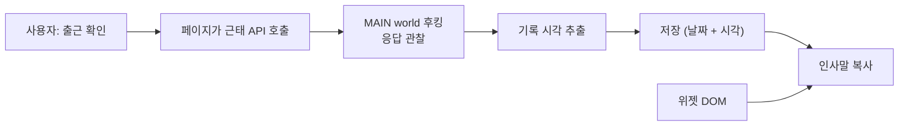

# 인사말 복사 — 새로고침 없이 쓰게 만들기

- 상태: **검토 완료. 구현 미착수**
- 작성일: 2026-09-09

## 1. 결론 먼저

**1번(모달에 버튼 추가)은 불가능하다.** 모달은 기록하기 *전에* 묻는 확인 창이고 **시각이
들어 있지 않다.** 데이터 원천이 될 수 없다.

**2번(데이터 갱신)으로 가야 하고, 그중 실현 가능한 것은 API 응답 후킹 하나다.**

기존 `인사말 복사` 버튼은 **그대로 둔다.** 모달을 놓쳤거나, 모달을 꺼놨거나, 새로고침을 한
경우의 경로다. 후킹은 "기록 직후 ~ 새로고침 전"의 공백만 메운다.

## 2. 1번을 버리는 근거

```text
출퇴근 체크
퇴근 체크 하시겠습니까?
[취소] [확인]
```

| 근거 | 내용 |
| --- | --- |
| **시각이 없다** | 기록 전 확인 창이므로 출근 시각이 아직 존재하지 않는다 |
| **끌 수 있다** | `오늘 하루 띄우지 않기` 체크박스가 있다. 끄면 모달이 아예 안 뜬다 |
| 사용자 요구와 충돌 | "모달을 놓치면 복사를 못 한다"는 문제를 그대로 남긴다 |

모달을 잡는 것 자체는 가능하다(`[class*="OBTConfirm_root"]`). 잡아도 얻을 정보가 없을 뿐이다.

확정 후 결과 모달이 따로 뜨고 거기에 시각이 있다면 이야기가 달라진다. **확인하지 못했다.**

## 3. 2번 하위 방안 평가

| 방안 | 판정 | 근거 |
| --- | --- | --- |
| a. 확장이 `getTodayComeLeaveInfo`를 직접 호출 | **불가** | 401 / `resultCode 601`. 본문에 사번·부서·회사 코드를 넣어도 동일. 페이지가 붙이는 헤더를 특정하지 못했다 |
| b. 페이지 자체 재조회 유도 | **불가** | 로드 시 1회만 호출한다. `notificationTools`가 쓰는 탭 클릭 같은 트리거가 위젯에 없다 |
| c. 자동 새로고침 | **권하지 않음** | 확실하지만 작성 중이던 내용이 날아간다 |
| d. 복사 순간의 브라우저 시계 | **불가** | 2026-08-26에 제거한 방식이다. 실제 근태와 어긋난 문구를 만든다 |
| **e. API 응답 후킹** | **채택** | 아래 |

## 4. 채택안 — MAIN world에서 출퇴근 응답을 잡는다

Confluence ProseMirror 브리지와 같은 기법이다. MAIN world 스크립트가 `XMLHttpRequest`와
`fetch`를 감싸 관찰만 하고, 결과를 content script로 넘긴다.



### 4.1 인사말 복사의 데이터 우선순위

| 순위 | 원천 | 언제 쓰이나 |
| --- | --- | --- |
| 1 | **위젯 DOM** | 새로고침 후. 서버가 준 권위 있는 값 |
| 2 | **후킹으로 잡은 기록 시각** | 같은 세션, 새로고침 전 |

위젯에 값이 있으면 **항상 위젯이 이긴다.** 후킹 값은 공백을 메우는 보조다.

### 4.2 시각을 얻는 두 경로

| 경로 | 정확도 | 조건 |
| --- | --- | --- |
| 응답 본문의 시각 필드 | 정확 | 응답에 시각이 있을 때 |
| API 성공 시점의 클라이언트 시계 | 오차 1초 안팎 | 위가 없을 때 |

두 번째는 2026-08-26에 제거한 방식과 **다르다.** 그때는 *복사하는 순간*의 시계라 출근 후
한참 뒤에 누르면 크게 어긋났다. 이번은 *API가 성공한 순간*이라 오차가 초 단위다.

다만 분 경계에서 1분 어긋날 수 있다. 그래서 응답에 시각이 있으면 그쪽을 우선한다.

### 4.3 저장 형태

| 항목 | 값 |
| --- | --- |
| 위치 | `chrome.storage.session` (없으면 `local`) |
| 키 | 날짜(`YYYY-MM-DD`)를 포함한다 |
| 이유 | 날짜가 바뀌면 어제 값을 쓰지 않아야 한다 |

날짜가 오늘이 아니면 무시하고 순위 1로 떨어진다.

### 4.4 후킹 범위

`/human/common/judgeTimeManagement/` 아래 **POST**만 관찰한다. 다음은 제외한다.

- `getTodayComeLeaveInfo` — 조회
- `confirmApplicationStatus` — 조회

응답을 읽되 **본문을 저장하거나 로그로 남기지 않는다.** 시각 필드만 뽑는다. 근태 응답에는
사번·부서 코드가 들어 있어 그대로 다루면 안 된다.

## 5. 확인이 필요한 것

**출근/퇴근 확정 API의 이름과 응답 형태를 모른다.** 모달의 `확인`을 눌러야 나오는데 실제
근태가 기록되므로 조사 중에는 누르지 않았다.

그래서 구현을 **형태를 몰라도 동작하도록** 방어적으로 짠다.

| 상황 | 동작 |
| --- | --- |
| 응답에 `HH:MM` 형태 값이 있다 | 그 값을 쓴다 |
| 없다 | API 성공 시점의 시계를 쓴다 |
| 요청이 실패했다 | 아무것도 저장하지 않는다 |

이렇게 하면 **다음 출근 때 기능이 동작하면서 동시에 형태도 드러난다.**

## 6. 하지 않는 것

| 항목 | 이유 |
| --- | --- |
| 기존 `인사말 복사` 버튼 변경 | 사용자 요구. 모달을 놓쳤을 때의 경로다 |
| 모달에 버튼 추가 | 2절. 시각이 없다 |
| 자동 새로고침 | 작성 중이던 내용이 날아간다 |
| 근태 API를 확장이 직접 호출 | 401. 인증 복제는 취약하고 DOM만 만지던 설계에서 벗어난다 |
| 응답 본문 저장·로깅 | 사번·부서 코드가 들어 있다 |

## 7. 위험

| 위험 | 완화 |
| --- | --- |
| 응답에 시각이 없고 분 경계에 걸림 | 1분 어긋날 수 있다. 위젯이 갱신되면 곧 정정된다 |
| 근태 API 경로가 바뀜 | 후킹이 아무것도 못 잡는다. 순위 1(위젯)로 떨어져 **현재 동작과 같아진다.** 퇴행이 아니다 |
| MAIN world 후킹이 페이지를 방해 | 관찰만 하고 원본 호출을 그대로 통과시킨다. 예외는 삼킨다 |
| 사용자가 다른 기기에서 출근 | 후킹이 못 잡는다. 위젯이 담당한다 |

## 8. 결정이 필요한 것

| # | 항목 | 권장 |
| --- | --- | --- |
| Q1 | 후킹 값을 쓸 때 사용자에게 표시할지 | 표시한다. 버튼 hover에 "이번 세션에서 기록된 시각" 정도 |
| Q2 | 저장 위치 | `chrome.storage.session` |
| Q3 | 결과 모달 조사 | 다음 출근 때 함께 확인한다 |
