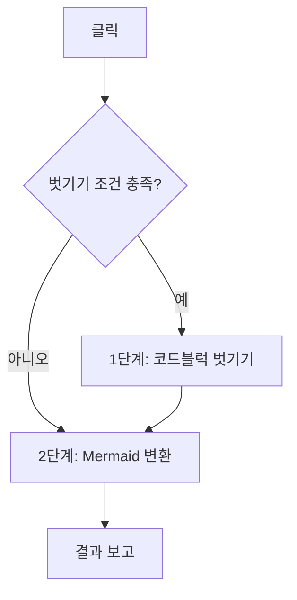

# 매직버튼 — 기술 검토와 설계

- 상태: **구현 완료(2026-09-04). 실제 tenant 검증 대기**
- 작성일: 2026-09-04

## 1. 결론 먼저

**합치는 것을 권장한다.** 두 버튼은 독립 선택지가 아니라 한 작업의 1단계·2단계이고, 순서가
사실상 고정돼 있다. 사용자가 헷갈리는 것은 UI가 잘못 나눠져 있기 때문이다.

조건 검사도 **반드시 넣어야 한다.** 다만 사용자가 제안한 "최상위가 코드블럭일 때"만으로는
부족하다. **"최상위 코드블럭" + "내용이 Markdown처럼 보임"** 두 조건을 함께 걸어야 한다.
전자만 걸면 큰 소스 코드 하나를 통째로 붙여넣은 문서를 산문으로 풀어버린다.

## 2. 이름 추천

| 후보 | 평가 |
| --- | --- |
| **`Markdown 변환`** | **권장.** 사용자 목적("내 Markdown을 Confluence 문서로")을 그대로 말한다. 내부 단계를 노출하지 않는다 |
| `Markdown 정리` | 무난하지만 "정리"가 기존 내용을 손댄다는 인상을 준다 |
| `한 번에 변환` | 무엇을 변환하는지가 빠졌다 |
| `자동 변환` | 사용자가 버튼을 눌러야 하므로 "자동"이 어색하다 |
| `ADF로 변환` | 현행 명칭과 일관되지만 `ADF`는 내부 용어다. 사용자는 몰라도 되는 개념이다 |

**`Markdown 변환`을 권장한다.** Popup 기능명이 `Markdown -> ADF 변환`이라 짝도 맞는다.

`매직`류 이름은 권하지 않는다. 이 버튼은 조건에 따라 아무것도 하지 않을 수 있는데, 이름이
"마법"이면 동작하지 않을 때 사용자가 원인을 짐작할 수 없다.

## 3. 동작 계약

한 번의 클릭에서 두 단계를 **순서대로** 실행한다.



### 1단계 — 코드블럭 벗기기 (조건부)

**두 조건을 모두 만족할 때만** 실행한다.

| # | 조건 | 이유 |
| --- | --- | --- |
| C1 | 대상이 **최상위** 코드블럭이다 | 목록·표·인용 안의 코드블럭은 문서 구조의 일부다 |
| C2 | 내용이 **Markdown 문서로 보인다** | 실제 소스 코드를 산문으로 푸는 사고를 막는다 |

C2 판정은 원문에 다음 중 **둘 이상**이 있을 때 참으로 한다.

- ATX 제목 (`^#{1,6}\s`)
- 표 구분선 (`^\s*\|?\s*:?-{3,}`)
- 코드 펜스 (` ``` `)
- 목록 (`^\s*([-*+]|\d+\.)\s`)
- 인용 (`^>\s`)

하나만으로는 오탐이 크다. YAML에 `- item`이 있고, 셸 스크립트에 `# 주석`이 있다.
**둘 이상**을 요구하면 실제 코드가 걸릴 확률이 크게 떨어진다.

### 2단계 — Mermaid 변환

현행 `Mermaid -> ADF`와 동일하다. 1단계가 실행됐다면 **DOM을 다시 조회한 뒤** 시작한다.

### 아무것도 할 게 없을 때

두 단계 모두 대상이 없으면 `변환할 내용이 없습니다`로 끝낸다. 오류가 아니다.

## 4. 벗기기 범위 — 세 가지 안

C1을 어떻게 좁히느냐가 핵심 결정이다.

| 안 | 범위 | 장점 | 단점 |
| --- | --- | --- | --- |
| **A** | 본문 전체가 코드블럭 **1개**일 때만 | 가장 안전. 오판 여지 거의 없음 | 기존 문서 중간에 붙여넣은 Markdown 블록은 변환 못 함 |
| **B** | **최상위** 코드블럭 중 C2를 만족하는 것 전부 | 중간 삽입도 처리. 실제 코드는 C2가 거른다 | C2 오탐 시 실제 코드가 풀린다 |
| C | 커서가 놓인 코드블럭 하나만 | 의도가 가장 분명 | 커서 위치를 브리지로 읽어야 함. 여러 개 처리 불가 |

**B를 권장한다.** A는 사용자 제안에 가장 가깝고 안전하지만, "문서 중간에 Markdown 한 덩이를
붙여넣고 푼다"는 현행 기능의 정상 사용을 없앤다. 그 회귀가 실제로 불편하다.

C2가 실질적 안전장치이므로 B에서도 실제 코드는 걸러진다. 실측 문서의 코드블럭 11개
(Kotlin·YAML·JSON·HTTP)는 어느 것도 "제목 + 표 구분선" 같은 조합을 갖지 않는다.

다만 **B를 택하더라도 벗길 대상 개수를 사전에 보여주고**, 2개 이상이면 사용자가 인지할 수
있게 라벨에 드러낸다.

## 5. 기술적 쟁점

### 5.1 최상위 판정은 래퍼를 넘어야 한다

코드블럭은 `.fabric-editor-breakout-mark` 안에 있어 편집기 직계 자식이 아니다.
기존 `findEditorTopLevelNode()`를 재사용해 판정한다.

```ts
function isTopLevelCodeBlock(editor: HTMLElement, codeBlock: HTMLElement): boolean {
  const top = findEditorTopLevelNode(editor, codeBlock);
  if (!top) return false;
  // 래퍼 안에 코드블럭 말고 다른 콘텐츠 노드가 없어야 최상위로 본다.
  const inner = Array.from(top.querySelectorAll<HTMLElement>('[data-prosemirror-node-name]'));
  return inner.length === 1 && inner[0] === codeBlock;
}
```

`resolveMermaidReplacementTarget()`이 expand에 대해 쓰는 판정과 같은 모양이다. 공용화할 수 있다.

`.ProseMirror-widget`는 `data-prosemirror-node-name`이 없어 이 방식에서 자연히 빠진다.

### 5.2 원문은 브리지로 읽어야 한다

C2 판정을 DOM 원문으로 하면 **30줄 넘는 블록에서 뒷부분을 못 본다.**
([관련 이슈](../../issue/2026-09-04-mermaid-verification-reads-truncated-dom.md))

Markdown 특징은 보통 앞부분에 나오므로 DOM 원문으로 1차 후보를 좁히고, 확정 판정은
`readCodeBlockSources()`가 읽은 **브리지 원문**으로 한다. `mayBeMermaidCodeBlock()`이
쓰는 방식과 동일한 2단 구조다.

### 5.3 단계 사이에 DOM을 다시 잡아야 한다

1단계가 끝나면 코드블럭 개수·순번·노드 참조가 전부 바뀐다. 2단계는 반드시
`context.document.querySelector(EDITOR_BODY)`부터 다시 시작한다. 현행 두 핸들러가 이미
각자 재조회하므로 그대로 순차 호출하면 된다.

`replaceMermaidCodeBlock()`이 쓰는 `codeBlockIndex`는 매크로의 `guestParams.index`가 되므로
**반드시 2단계 시작 시점에 다시 센다.** 1단계 이전 순번을 넘기면 잘못된 원본을 가리킨다.

### 5.4 짝 없는 Mermaid 컴포넌트 가드

2단계는 짝 없는 기존 Mermaid 컴포넌트가 있으면 중단한다. 매직버튼에서는 **1단계가 이미 문서를
바꾼 뒤** 이 가드가 걸릴 수 있다.

- A안이면 문제없다. 본문이 코드블럭 1개였으므로 컴포넌트가 있을 수 없다.
- **B안이면 가드를 1단계 전에 미리 확인해야 한다.** 걸릴 상황이면 아무것도 하지 않고 안내한다.

### 5.5 부분 실패 보고

전역 되돌리기는 하지 않는다. Confluence 실행 취소는 transaction 단위라 여러 단계를 한 번에
되돌릴 수 없고, 억지로 반복 클릭하면 사용자의 다른 편집까지 지운다.

대신 단계별 결과를 라벨과 hover로 나눠 보고한다.

```text
벗기기 1 · Mermaid 7          정상
벗기기 1 · Mermaid 5/7 실패    부분 성공
```

### 5.6 진행 표시

Mermaid 변환은 후보당 최대 3초가 걸려 7개면 20초를 넘길 수 있다. 현행은 그동안 `변환 중`만
떠 있어 멈춘 것처럼 보인다. 매직버튼은 단계·진행을 라벨에 드러낸다.

```text
벗기는 중 → Mermaid 3/7 → 완료
```

### 5.7 지연 로딩 유지

`loadCodeBlockConverter()`는 `marked`(47KB)를 클릭 시점에 불러온다. 1단계를 건너뛰는 경우에는
**불러오지 않아야** 한다. 조건 판정을 로딩보다 먼저 한다.

## 6. 버리는 것과 그 대가

| 잃는 것 | 영향 | 완화 |
| --- | --- | --- |
| 코드블럭만 벗기고 Mermaid는 남기는 선택 | Mermaid 코드블럭이 있으면 항상 함께 변환된다 | 실사용에서 1단계만 원하는 경우를 확인하지 못했다. 필요해지면 수식어 키(Alt 클릭 등)로 되살릴 수 있다 |
| 목록·표 안의 코드블럭 벗기기 | C1에서 제외된다 | 현행에서도 흔한 사용은 아니다. 필요하면 C1을 완화한다 |
| 실제 코드를 **의도적으로** 산문으로 풀기 | C2가 막는다 | 의도적 사용이라 보기 어렵다. 막는 편이 낫다 |

## 7. 구현 범위

| 항목 | 내용 |
| --- | --- |
| 버튼 host | 버튼 2개 + divider를 1개로 교체 |
| 핸들러 | 두 핸들러 본문을 함수로 추출해 순차 호출하는 단일 핸들러 작성 |
| 신규 판정 | `isTopLevelCodeBlock()`, `looksLikeMarkdownDocument()` |
| 라벨 | 단계·진행·부분 실패를 표현하도록 확장 |
| spec | `사용자 경험과 행동 계약`의 편집기 절 재작성, 변경 이력 추가 |
| 테스트 | `looksLikeMarkdownDocument()` 판정, 최상위 판정, 단계 순서 |

## 8. 확인하지 못한 것

- **사용자가 1단계만 쓰는 경우가 실제로 있는지** 확인하지 못했다. 없다고 가정하고 설계했다.
- C2 임계값("특징 둘 이상")을 실제 문서 표본으로 검증하지 못했다. 실측 문서 하나(코드블럭 18개)
  에서만 확인했다.
- 커서 위치 기반 대상 선택(C안)의 브리지 비용을 측정하지 않았다.

## 9. 확정된 결정과 구현 내용

| # | 항목 | 확정 | 비고 |
| --- | --- | --- | --- |
| Q1 | 버튼 이름 | **`Markdown 변환`** | 권장안 채택 |
| Q2 | 벗기기 범위 | **원래 동작 그대로 + `if` 게이트** | 사용자 결정. 벗기기 함수는 손대지 않고 실행 여부만 가른다 |
| Q3 | Markdown 판정 임계값 | **특징 2종 이상** | 권장안 채택 |
| Q4 | 1단계 단독 실행 경로 | **남기지 않음** | 권장안 채택 |
| Q5 | 부분 실패 시 전역 되돌리기 | **하지 않음** | 권장안 채택 |

### Q2 해석

벗기기 **동작**은 종전 `코드블럭 -> ADF`와 동일하다. 대상 범위를 줄이지 않았다. 대신 실행 여부를
게이트가 가른다.

```ts
if (shouldUnwrapCodeBlocks(editor)) {
  await runCodeBlockPhase(editor, onProgress);
  editor = getEditor();   // 순번·노드 참조가 전부 바뀐다
}
await runMermaidPhase(editor, onProgress);
```

게이트가 세 조건을 요구한다.

1. 보호 대상이 아닌 코드블럭이 하나 이상 있다
2. 그중 최상위에 놓인 것이 하나 이상 있다
3. **전부** Markdown 문서로 보인다

3번이 핵심이다. 벗기기 동작이 문서의 모든 코드블럭을 대상으로 하므로, 실제 코드가 하나라도 섞여
있으면 실행해서는 안 된다.

## 10. 구현 결과

| 항목 | 내용 |
| --- | --- |
| 신규 모듈 | `markdown-detection.ts` — `looksLikeMarkdownDocument()`, `findMarkdownFeatures()` |
| 신규 판정 | `isTopLevelCodeBlock()`, `shouldUnwrapCodeBlocks()`, `wrapsOnlyNode()` |
| 단계 추출 | `runCodeBlockPhase()`, `runMermaidPhase()` |
| 결과 요약 | `describeConversionResult()` |
| UI | 버튼 2개 + divider → `Markdown 변환` 버튼 1개 |
| 진행 표시 | `확인 중` → `코드블럭 2/3` → `Mermaid 3/7` → 결과 |
| 가드 이동 | 짝 없는 Mermaid 컴포넌트 검사를 **1단계 이전**으로 옮김 |
| 미변환 진단 | `findUnconvertedMarkdown()`, `describeUnconvertedMarkdown()` — 11절 |

### 게이트 실측 (대상 문서 `edit-v2/2246476007`)

변환이 끝난 문서에서 게이트를 시뮬레이션했다.

| 항목 | 값 |
| --- | --- |
| 코드블럭 | 18 |
| 보호 대상(Mermaid 원본 짝) | 7 |
| 판정 대상 | 11 |
| 최상위인 것 | 11 |
| **Markdown으로 보이는 것** | **0** |
| **게이트 결과** | **`false` — 벗기지 않음** |

11개는 Kotlin·YAML·JSON·HTTP 요청이고 Markdown 특징이 하나도 없다.
**종전 `코드블럭 -> ADF`였다면 이 11개가 전부 산문으로 풀렸다.** 게이트가 그 사고를 막는다.

### 검증 상태

| 항목 | 결과 |
| --- | --- |
| `npm run typecheck` | 통과 |
| `npm test` | **93개 통과** (+6) |
| `npm run build` | 통과 |
| 게이트 실측 | 확인 완료 (위 표) |
| **실제 클릭 동작** | **미검증** — 확장 재로드 후 확인 필요 |

## 11. 미변환 Markdown 진단 (추가 구현)

### 왜 넣었나

게이트는 코드블럭만 본다. 원문을 코드블럭이 아니라 **본문에 그대로 붙여넣으면** 각 줄이 문단이
되어 코드블럭이 0개다. 1단계도 2단계도 할 일이 없어 `변환할 내용이 없습니다`로 끝나는데,
사용자는 왜 안 되는지 알 수 없다.

### 판정 원리

Markdown이 정상 변환되면 **문법 문자가 소비돼 사라진다.**

```text
# 제목      → heading 노드,   텍스트에 '#' 없음
| a | b |   → table 노드,     텍스트에 '|' 없음
```         → codeBlock 노드, 텍스트에 백틱 없음
```

그래서 "문법이 보이는가"가 아니라 **신호와 그것이 되었어야 할 노드를 짝지어** 본다.

| 조건 | 판정 |
| --- | --- |
| 노드 > 0 | **보류** — 문서가 Markdown을 인용 중일 수 있다 |
| 노드 == 0 이고 증거 있음 | **미변환 확정** |
| 그 외 | 보류 |

### 문법을 먼저 엄격히 본다

신호는 **CommonMark·GFM 문법을 실제로 만족하는 줄만** 센다.

| 구성 | 문법 조건 | 걸러지는 것 |
| --- | --- | --- |
| 제목 | 들여쓰기 3칸 이하 · `#` 1~6개 · 뒤에 공백 · 그 뒤 내용 | `#태그`, `#123`, `#######`, 4칸 들여쓴 줄 |
| 표 구분선 | 각 칸이 `-` 1개 이상이며 앞뒤 `:` 허용 | 파이프가 든 일반 문장 |
| 펜스 | 들여쓰기 3칸 이하 · 백틱/물결 3개 이상 | 인라인 백틱 |
| 인용 | 들여쓰기 3칸 이하 · `>` 뒤 내용 | `>` 만 있는 줄 |

### 증거를 요구하는 이유

문법을 만족해도 그것만으로는 부족하다. 처음에는 `신호 > 0 이고 노드 == 0`만으로 확정했는데
**틀렸다.** 사용자가 일반 문서에 `# TODO` 한 줄을 일부러 쓸 수 있다. 손으로 쓴 문서를 흉내낸
표본에서 **7개 중 4개를 오탐**했다.

```text
할 일 메모에 # 한 줄   -> 오탐: 제목 1
표처럼 보이는 한 줄    -> 오탐: 표 1
인용 부호 한 줄       -> 오탐: 인용 1
펜스 한 개만         -> 오탐: 코드블럭 1
```

그래서 개수가 아니라 **구조**를 본다. 셋 중 하나를 만족해야 확정한다.

| 증거 | 조건 | 근거 |
| --- | --- | --- |
| 표 구조 | 표 행 바로 다음 줄이 구분선이고 **칸 수가 같다** | 두 줄을 그 순서와 칸 수로 우연히 쓰지 않는다 |
| 펜스 짝 | 같은 문자 · 길이 이상 · info string 없는 닫는 펜스 | 여는 것과 닫는 것이 쌍이다 |
| 반복 | 같은 구성 신호 3개 이상 | 한두 번은 의도일 수 있어도 반복은 아니다 |

제목과 인용에는 짝을 이루는 구조가 없어 반복으로만 확정한다.

### 신호 선정

| 신호 | 채택 | 이유 |
| --- | --- | --- |
| 표 구분선 `\|---\|` | 채택 | 정상 산문에 나올 일이 없다 |
| 코드 펜스 ``` | 채택 | 쌍으로 나타난다. 실측 문서에서 36 = 18 × 2 |
| 제목 `# ` | 채택 | `#` 뒤 공백을 요구해 `#123`·해시태그를 거른다 |
| 인용 `> ` | 채택 | 인용 부호를 직접 쓰는 사람은 드물다 |
| `**굵게**`, `` `코드` ``, `[링크](url)` | **제외** | 정상 산문에도 흔해 오탐이 크다 |

### 양방향 측정

저장소의 Markdown 문서 **28개**(`spec/`, `spec/features/`, `docs/`, `docs/issue/`)로 측정했다.

| 표본 | 방법 | 결과 |
| --- | --- | --- |
| **손으로 쓴 문서 · 문법 미달** | `# TODO` 한 줄, 칸 수 안 맞는 표, 닫는 펜스에 info string 등 13종 | 오탐 **0 / 13** |
| **확실한 Markdown** | 표 1개 · 펜스 1쌍 · 제목 3개 | 놓침 **0 / 3** |
| **정상 변환 결과** | 저장소 문서 28개를 변환기에 통과시킨 ADF | 오탐 **0 / 28** |
| **원문 붙여넣기** | 각 줄이 문단이 된 상태를 흉내내 판정 | 감지 **28 / 28** |

경계 확인도 했다. 제목 2줄은 보류, 3줄은 확정이다. 세 줄이 전부 `# `로 시작하는데 heading
노드가 0이면 미변환으로 보는 것이 맞다.

오탐 표본에는 Markdown 문법·표·펜스를 잔뜩 **인용하는** `spec/features/*.md`가 포함된다.
인용된 예시는 코드블럭 안에 있어 문단 텍스트로 새어나오지 않는다.

신호별 적중 문서 수는 `제목 28, 표 구분선 22, 표 행 22, 펜스 21, 인용 5`다. **제목 하나만으로도
28개 전부 잡힌다.**

### 실제 문서 실측

대상 문서(`edit-v2/2246476007`, 원문을 문단으로 붙여넣은 상태)에서의 판정이다.

| 구성 | 신호 | 노드 | 판정 |
| --- | --- | --- | --- |
| 제목 | 38 | 0 | 미변환 확정 |
| 표 | 191 | 0 | 미변환 확정 |
| 코드블럭 | 36 | 0 | 미변환 확정 |
| 인용 | 22 | 0 | 미변환 확정 |

버튼에는 이렇게 나온다.

```text
미변환 Markdown · 제목 38 · 표 191 · 코드블럭 36 · 인용 22
```

hover에는 원문 전체를 코드블럭에 넣고 다시 실행하라는 안내를 붙인다.

### 자동 변환은 하지 않는다

본문 전체 Markdown 변환 버튼은 2026-08-12에 이미 제거된 이력이 있다. "이미 서식화된 본문은
손실 방지를 위해 거부한다"를 판정할 방법이 없어서였다. 이 진단이 그 판정 수단이 될 수는 있지만,
잘못 판정하면 문서를 통째로 망친다. **안내까지만 하고 부활 여부는 별도 결정으로 남긴다.**

## 12. 남은 위험

| 위험 | 내용 |
| --- | --- |
| 혼합 문서 | Markdown 코드블럭과 실제 코드가 **둘 다** 있으면 게이트가 `false`가 되어 벗기기가 아예 안 된다. 안전하지만 사용자는 왜 안 되는지 모른다. 안내 문구가 필요할 수 있다 |
| 판정 오탐 | Markdown 특징 2종을 우연히 갖는 코드(예: 주석에 표를 그린 코드)가 있으면 풀릴 수 있다 |
| DOM 30줄 제한 | 게이트는 DOM 원문으로 판정한다. Markdown 특징이 31줄 이후에만 있는 문서는 게이트를 통과하지 못한다 |
